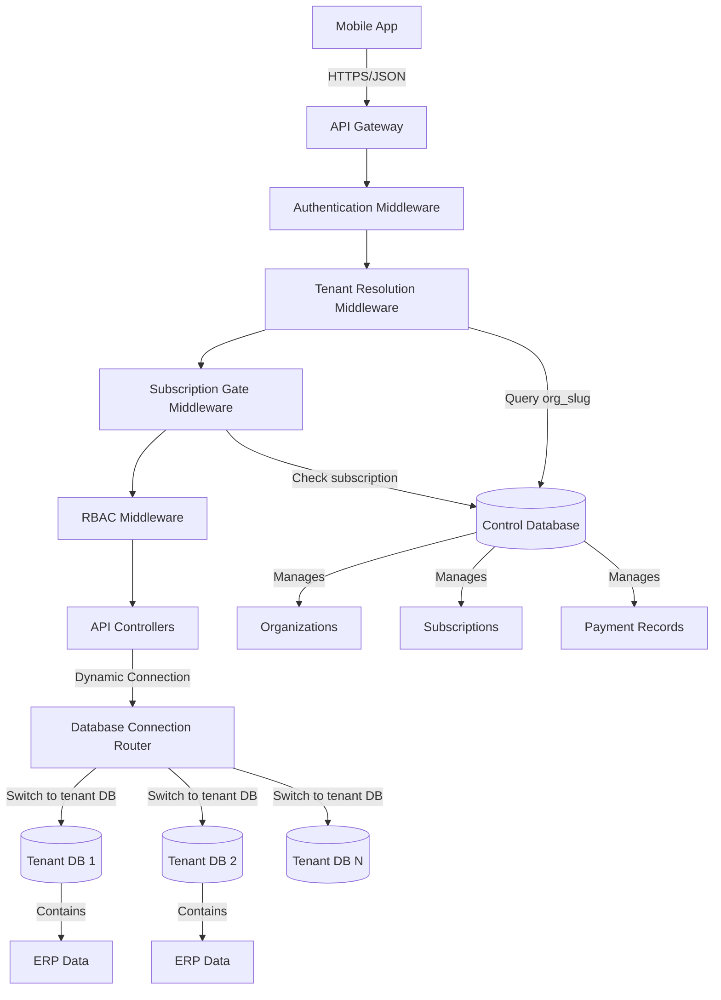
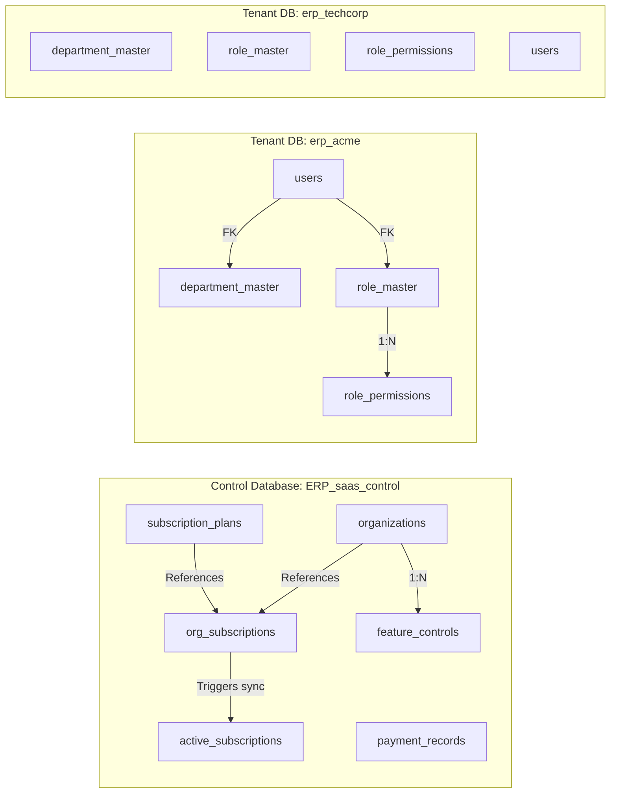

# Design Document: Laravel Multi-Tenant ERP Foundation

## Overview

This design document specifies the technical architecture for a multi-tenant Laravel ERP system foundation. The system implements a two-database architecture pattern where a centralized Control Database (ERP_saas_control) manages all tenant organizations, subscriptions, billing, and feature controls, while separate Tenant Databases (erp_{slug}) store each organization's isolated ERP operational data.

The architecture prioritizes tenant isolation, subscription-based access control, and scalability. All functionality is exposed through RESTful APIs designed for mobile app consumption, with comprehensive role-based access control (RBAC) at the module level.

### Key Design Principles

1. **Complete Tenant Isolation**: Each tenant's data resides in a physically separate database, eliminating any possibility of cross-tenant data access
2. **Subscription-Driven Access**: All API access is gated by active subscription validation with module-level entitlements
3. **Immutable Financial Ledger**: Payment records form an append-only ledger for complete audit trail
4. **Dynamic Database Routing**: Runtime database connection switching based on tenant context extracted from requests
5. **Automated Tenant Provisioning**: Zero-touch tenant database creation, migration, and seeding workflow
6. **API-First Design**: All functionality exposed through versioned RESTful APIs with consistent JSON response formats

### Technology Stack

- **Framework**: Laravel 10.x or higher
- **Database**: MySQL 8.0+ (separate instances for Control DB and Tenant DBs)
- **Authentication**: JWT tokens with 24-hour expiration
- **Caching**: Redis for rate limiting and permission caching
- **Queue System**: Laravel Queue for async tenant provisioning
- **Payment Gateways**: Razorpay and Stripe integration support


## Architecture

### System Architecture Overview

The system follows a multi-tenant architecture with database-per-tenant isolation strategy. This provides the strongest isolation guarantees while maintaining centralized control over subscriptions and billing.



### Request Flow Architecture

Every API request follows this processing pipeline:

1. **API Gateway**: Receives request, validates basic structure
2. **Authentication Middleware**: Validates JWT token, extracts user_id and org_id
3. **Tenant Resolution Middleware**: Extracts org_slug from request, queries Control DB for tenant_db_name, validates organization status
4. **Subscription Gate Middleware**: Queries active_subscriptions, validates subscription status and module access
5. **RBAC Middleware**: Loads user permissions from Tenant DB, validates module-level access
6. **Database Connection Router**: Switches active connection to resolved Tenant DB
7. **Controller**: Executes business logic against Tenant DB
8. **Response Formatter**: Returns consistent JSON response


### Multi-Tenant Database Architecture



The architecture enforces complete isolation:
- Each tenant database is a separate MySQL database instance
- No foreign keys cross database boundaries
- Database connection routing happens at runtime based on tenant context
- Control Database never contains tenant operational data
- Tenant Databases never contain subscription or billing data


### Middleware Stack Architecture

The middleware stack processes requests in this order:

```
Request → API Gateway
    ↓
[1] Authentication Middleware (ValidateJWT)
    - Validates JWT signature and expiration
    - Extracts user_id, org_id from token claims
    - Returns 401 if invalid
    ↓
[2] Tenant Resolution Middleware (ResolveTenant)
    - Extracts org_slug from request (header or route param)
    - Queries Control DB: organizations table
    - Validates registration_status (ACTIVE only)
    - Resolves tenant_db_name
    - Returns 400/404/403/410 based on validation
    ↓
[3] Subscription Gate Middleware (ValidateSubscription)
    - Queries Control DB: active_subscriptions table
    - Validates subscription_status
    - Checks module access in modules_allowed
    - Enforces grace period for PAST_DUE
    - Returns 402/403 if invalid
    ↓
[4] RBAC Middleware (CheckModulePermission)
    - Switches to Tenant DB connection
    - Loads role_permissions for user's role
    - Validates can_view/can_create/can_edit/can_approve/can_delete
    - Caches permissions for 15 minutes
    - Returns 403 if denied
    ↓
[5] Rate Limit Middleware (ThrottleRequests)
    - Checks Redis counter for org_id
    - Compares against api_rate_limit_day
    - Increments counter
    - Returns 429 if exceeded
    ↓
Controller → Business Logic → Response
```


## Components and Interfaces

### Database Connection Router

**Purpose**: Dynamically switch database connections based on tenant context

**Interface**:
```php
interface DatabaseConnectionRouter
{
    /**
     * Switch to tenant database connection
     * @param string $tenantDbName Database name (e.g., "erp_acme")
     * @throws TenantDatabaseNotFoundException
     * @throws TenantDatabaseConnectionException
     */
    public function switchToTenant(string $tenantDbName): void;
    
    /**
     * Switch to control database connection
     */
    public function switchToControl(): void;
    
    /**
     * Get current active connection name
     * @return string Connection name ("control" or tenant db name)
     */
    public function getCurrentConnection(): string;
    
    /**
     * Verify tenant database exists and is accessible
     * @param string $tenantDbName
     * @return bool
     */
    public function verifyTenantDatabase(string $tenantDbName): bool;
}
```

**Implementation Strategy**:
- Use Laravel's `Config::set('database.connections.tenant', [...])` to dynamically configure connection
- Use `DB::purge('tenant')` and `DB::reconnect('tenant')` to switch connections
- Maintain connection state in request lifecycle
- Log all connection switches with org_id and timestamp


### Tenant Provisioning Service

**Purpose**: Automate creation and initialization of new tenant databases

**Interface**:
```php
interface TenantProvisioningService
{
    /**
     * Provision a new tenant database
     * @param int $orgId Organization ID from Control DB
     * @return ProvisioningResult
     * @throws ProvisioningException
     */
    public function provisionTenant(int $orgId): ProvisioningResult;
    
    /**
     * Rollback failed provisioning
     * @param int $orgId
     */
    public function rollbackProvisioning(int $orgId): void;
    
    /**
     * Check provisioning status
     * @param int $orgId
     * @return ProvisioningStatus
     */
    public function getProvisioningStatus(int $orgId): ProvisioningStatus;
}

class ProvisioningResult
{
    public bool $success;
    public string $tenantDbName;
    public ?string $errorMessage;
    public array $steps; // Completed steps log
}
```

**Provisioning Workflow**:
1. Validate organization exists and is in PENDING status
2. Generate tenant_db_name: "erp_{org_slug}"
3. Create MySQL database using raw SQL: `CREATE DATABASE erp_{org_slug}`
4. Update organizations.tenant_db_name
5. Run tenant migrations: `php artisan migrate --database=tenant --path=database/migrations/tenant`
6. Seed master data: default roles, permissions, root department
7. Create initial admin user with temporary password
8. Send welcome email with credentials
9. Update organizations.registration_status to ACTIVE
10. Create trial subscription in org_subscriptions
11. Log provisioning completion

**Error Handling**:
- Wrap entire process in database transaction where possible
- On failure: log error, keep status as PENDING, notify admins
- Provide retry mechanism for failed provisioning
- Implement idempotency: safe to retry provisioning for same org_id


### Subscription Management Service

**Purpose**: Handle subscription lifecycle, billing, and access control

**Interface**:
```php
interface SubscriptionManagementService
{
    /**
     * Create trial subscription for new tenant
     * @param int $orgId
     * @return Subscription
     */
    public function createTrialSubscription(int $orgId): Subscription;
    
    /**
     * Upgrade from trial to paid subscription
     * @param int $orgId
     * @param int $planId
     * @return Subscription
     */
    public function upgradeToPaid(int $orgId, int $planId): Subscription;
    
    /**
     * Process subscription renewal
     * @param int $subscriptionId
     * @return RenewalResult
     */
    public function processRenewal(int $subscriptionId): RenewalResult;
    
    /**
     * Cancel subscription
     * @param int $subscriptionId
     * @param string $reason
     * @return bool
     */
    public function cancelSubscription(int $subscriptionId, string $reason): bool;
    
    /**
     * Check if organization has active subscription
     * @param int $orgId
     * @return bool
     */
    public function hasActiveSubscription(int $orgId): bool;
    
    /**
     * Get modules allowed for organization
     * @param int $orgId
     * @return array Module codes
     */
    public function getAllowedModules(int $orgId): array;
}
```

**Subscription State Machine**:
```
TRIAL → [trial_end_date reached] → EXPIRED
TRIAL → [payment success] → ACTIVE
ACTIVE → [next_billing_date + payment success] → ACTIVE (renewed)
ACTIVE → [next_billing_date + payment failed] → PAST_DUE
ACTIVE → [user cancels] → CANCELLED
PAST_DUE → [payment success within grace period] → ACTIVE
PAST_DUE → [grace_period_until exceeded] → SUSPENDED (org status)
CANCELLED → [period_end_date reached] → EXPIRED
```


### Payment Processing Service

**Purpose**: Handle payment gateway integration and transaction recording

**Interface**:
```php
interface PaymentProcessingService
{
    /**
     * Create payment intent for subscription
     * @param int $subscriptionId
     * @return PaymentIntent
     */
    public function createPaymentIntent(int $subscriptionId): PaymentIntent;
    
    /**
     * Process payment gateway callback
     * @param string $gatewayName (razorpay|stripe)
     * @param array $payload
     * @return PaymentResult
     */
    public function processCallback(string $gatewayName, array $payload): PaymentResult;
    
    /**
     * Record payment transaction
     * @param PaymentData $data
     * @return PaymentRecord
     */
    public function recordPayment(PaymentData $data): PaymentRecord;
    
    /**
     * Process refund
     * @param int $originalPaymentId
     * @param float $amount
     * @param string $reason
     * @return PaymentRecord
     */
    public function processRefund(int $originalPaymentId, float $amount, string $reason): PaymentRecord;
    
    /**
     * Calculate tax amounts based on country
     * @param float $taxableAmount
     * @param string $countryCode
     * @return TaxBreakdown
     */
    public function calculateTax(float $taxableAmount, string $countryCode): TaxBreakdown;
}

class TaxBreakdown
{
    public float $cgstAmount = 0.0;
    public float $sgstAmount = 0.0;
    public float $igstAmount = 0.0;
    public float $totalTax = 0.0;
}
```

**Payment Flow**:
1. Generate invoice when next_billing_date is reached
2. Create payment_records entry with status PENDING
3. Call payment gateway API to create payment intent
4. Store gateway_payment_id
5. Wait for webhook callback from gateway
6. Validate webhook signature
7. Update payment_records.payment_status based on gateway response
8. If SUCCESS: update subscription, extend period
9. If FAILED: update subscription to PAST_DUE, set grace period
10. Send email notification to customer


### RBAC Permission Service

**Purpose**: Manage role-based access control and permission checking

**Interface**:
```php
interface RBACPermissionService
{
    /**
     * Check if user has permission for module action
     * @param int $userId
     * @param string $moduleCode
     * @param string $action (view|create|edit|approve|delete)
     * @return bool
     */
    public function hasPermission(int $userId, string $moduleCode, string $action): bool;
    
    /**
     * Get all permissions for user
     * @param int $userId
     * @return array Keyed by module_code
     */
    public function getUserPermissions(int $userId): array;
    
    /**
     * Update role permissions
     * @param int $roleId
     * @param string $moduleCode
     * @param array $permissions
     * @return bool
     */
    public function updateRolePermissions(int $roleId, string $moduleCode, array $permissions): bool;
    
    /**
     * Invalidate permission cache for user
     * @param int $userId
     */
    public function invalidateCache(int $userId): void;
    
    /**
     * Get modules accessible by user
     * @param int $userId
     * @return array Module codes where can_view = true
     */
    public function getAccessibleModules(int $userId): array;
}
```

**Permission Caching Strategy**:
- Cache key: `rbac:user:{user_id}:permissions`
- TTL: 15 minutes
- Cache structure: `['PR' => ['view' => true, 'create' => true, ...], ...]`
- Invalidate on: role_permissions update, user role change
- Use Redis for distributed caching across app servers


### Authentication Service

**Purpose**: Handle user authentication and JWT token management

**Interface**:
```php
interface AuthenticationService
{
    /**
     * Authenticate user and issue tokens
     * @param string $email
     * @param string $password
     * @param string $orgSlug
     * @return AuthResult
     * @throws AuthenticationException
     */
    public function login(string $email, string $password, string $orgSlug): AuthResult;
    
    /**
     * Refresh access token using refresh token
     * @param string $refreshToken
     * @return AuthResult
     * @throws InvalidTokenException
     */
    public function refreshToken(string $refreshToken): AuthResult;
    
    /**
     * Revoke refresh token (logout)
     * @param string $refreshToken
     */
    public function logout(string $refreshToken): void;
    
    /**
     * Validate JWT token
     * @param string $token
     * @return TokenPayload
     * @throws InvalidTokenException
     */
    public function validateToken(string $token): TokenPayload;
}

class AuthResult
{
    public string $accessToken;  // JWT, 24-hour expiry
    public string $refreshToken; // 30-day expiry
    public int $expiresIn;       // Seconds until access token expires
    public User $user;
}

class TokenPayload
{
    public int $userId;
    public int $orgId;
    public string $orgSlug;
    public int $issuedAt;
    public int $expiresAt;
}
```

**JWT Token Structure**:
```json
{
  "sub": "user_id",
  "org_id": 123,
  "org_slug": "acme",
  "iat": 1234567890,
  "exp": 1234654290,
  "type": "access"
}
```

**Authentication Flow**:
1. Receive login request with email, password, org_slug
2. Switch to Control DB, resolve org_id from org_slug
3. Validate organization is ACTIVE
4. Switch to Tenant DB for that organization
5. Query users table by email
6. Verify password using `Hash::check()`
7. Update last_login_at timestamp
8. Generate access token (24h) and refresh token (30d)
9. Store refresh token in Redis with user_id mapping
10. Return tokens to client


## Data Models

### Control Database Models

#### Organization Model

**Table**: `organizations`

**Schema**:
```sql
CREATE TABLE organizations (
    org_id INT UNSIGNED AUTO_INCREMENT PRIMARY KEY,
    org_slug VARCHAR(100) NOT NULL UNIQUE,
    org_name VARCHAR(255) NOT NULL,
    tenant_db_name VARCHAR(100) NOT NULL UNIQUE,
    registration_status ENUM('PENDING', 'ACTIVE', 'SUSPENDED', 'TERMINATED') NOT NULL DEFAULT 'PENDING',
    
    -- Contact Information
    primary_email VARCHAR(255) NOT NULL UNIQUE,
    primary_phone VARCHAR(20),
    address_line1 VARCHAR(255),
    address_line2 VARCHAR(255),
    city VARCHAR(100),
    state VARCHAR(100),
    postal_code VARCHAR(20),
    country_code CHAR(2) NOT NULL,
    
    -- Localization
    timezone VARCHAR(50) NOT NULL DEFAULT 'UTC',
    currency_code CHAR(3) NOT NULL DEFAULT 'USD',
    
    -- Capacity
    max_users INT UNSIGNED NOT NULL DEFAULT 10,
    
    -- Timestamps
    created_at TIMESTAMP DEFAULT CURRENT_TIMESTAMP,
    activated_at TIMESTAMP NULL,
    suspended_at TIMESTAMP NULL,
    terminated_at TIMESTAMP NULL,
    
    INDEX idx_org_slug (org_slug),
    INDEX idx_registration_status (registration_status)
) ENGINE=InnoDB DEFAULT CHARSET=utf8mb4 COLLATE=utf8mb4_unicode_ci;
```

**Eloquent Model**:
```php
namespace App\Models\Control;

class Organization extends Model
{
    protected $connection = 'control';
    protected $table = 'organizations';
    protected $primaryKey = 'org_id';
    
    protected $fillable = [
        'org_slug', 'org_name', 'tenant_db_name', 'registration_status',
        'primary_email', 'primary_phone', 'address_line1', 'address_line2',
        'city', 'state', 'postal_code', 'country_code',
        'timezone', 'currency_code', 'max_users'
    ];
    
    protected $casts = [
        'activated_at' => 'datetime',
        'suspended_at' => 'datetime',
        'terminated_at' => 'datetime',
    ];
    
    // Relationships
    public function subscriptions()
    {
        return $this->hasMany(OrgSubscription::class, 'org_id', 'org_id');
    }
    
    public function activeSubscription()
    {
        return $this->hasOne(ActiveSubscription::class, 'org_id', 'org_id');
    }
    
    public function featureControls()
    {
        return $this->hasMany(FeatureControl::class, 'org_id', 'org_id');
    }
    
    // Scopes
    public function scopeActive($query)
    {
        return $query->where('registration_status', 'ACTIVE');
    }
}
```


#### Subscription Plan Model

**Table**: `subscription_plans`

**Schema**:
```sql
CREATE TABLE subscription_plans (
    plan_id INT UNSIGNED AUTO_INCREMENT PRIMARY KEY,
    plan_code VARCHAR(50) NOT NULL UNIQUE,
    plan_name VARCHAR(100) NOT NULL,
    description TEXT,
    
    -- Billing
    billing_cycle ENUM('MONTHLY', 'QUARTERLY', 'ANNUAL') NOT NULL,
    price_amount DECIMAL(10, 2) NOT NULL,
    currency_code CHAR(3) NOT NULL DEFAULT 'USD',
    
    -- Capacity Limits
    max_users INT UNSIGNED NOT NULL,
    max_warehouses INT UNSIGNED NOT NULL,
    max_materials INT UNSIGNED NOT NULL,
    storage_gb INT UNSIGNED NOT NULL,
    api_rate_limit_day INT UNSIGNED NOT NULL,
    
    -- Features
    modules_included JSON NOT NULL, -- Array of module codes
    
    -- Status
    is_active BOOLEAN NOT NULL DEFAULT TRUE,
    is_public BOOLEAN NOT NULL DEFAULT TRUE,
    
    -- Timestamps
    created_at TIMESTAMP DEFAULT CURRENT_TIMESTAMP,
    updated_at TIMESTAMP DEFAULT CURRENT_TIMESTAMP ON UPDATE CURRENT_TIMESTAMP,
    
    INDEX idx_plan_code (plan_code),
    INDEX idx_is_active (is_active)
) ENGINE=InnoDB DEFAULT CHARSET=utf8mb4 COLLATE=utf8mb4_unicode_ci;
```

**Eloquent Model**:
```php
namespace App\Models\Control;

class SubscriptionPlan extends Model
{
    protected $connection = 'control';
    protected $table = 'subscription_plans';
    protected $primaryKey = 'plan_id';
    
    protected $fillable = [
        'plan_code', 'plan_name', 'description',
        'billing_cycle', 'price_amount', 'currency_code',
        'max_users', 'max_warehouses', 'max_materials', 'storage_gb', 'api_rate_limit_day',
        'modules_included', 'is_active', 'is_public'
    ];
    
    protected $casts = [
        'price_amount' => 'decimal:2',
        'modules_included' => 'array',
        'is_active' => 'boolean',
        'is_public' => 'boolean',
    ];
    
    // Relationships
    public function subscriptions()
    {
        return $this->hasMany(OrgSubscription::class, 'plan_id', 'plan_id');
    }
}
```


#### Organization Subscription Model

**Table**: `org_subscriptions`

**Schema**:
```sql
CREATE TABLE org_subscriptions (
    subscription_id INT UNSIGNED AUTO_INCREMENT PRIMARY KEY,
    org_id INT UNSIGNED NOT NULL,
    plan_id INT UNSIGNED NOT NULL,
    
    -- Status
    subscription_status ENUM('TRIAL', 'ACTIVE', 'PAST_DUE', 'CANCELLED', 'EXPIRED') NOT NULL,
    
    -- Trial Period
    trial_start_date DATE NULL,
    trial_end_date DATE NULL,
    
    -- Billing Period
    current_period_start DATE NOT NULL,
    current_period_end DATE NOT NULL,
    next_billing_date DATE NULL,
    
    -- Grace Period
    grace_period_until TIMESTAMP NULL,
    
    -- Cancellation
    cancelled_at TIMESTAMP NULL,
    cancellation_reason TEXT NULL,
    
    -- Timestamps
    created_at TIMESTAMP DEFAULT CURRENT_TIMESTAMP,
    updated_at TIMESTAMP DEFAULT CURRENT_TIMESTAMP ON UPDATE CURRENT_TIMESTAMP,
    
    FOREIGN KEY (org_id) REFERENCES organizations(org_id) ON DELETE CASCADE,
    FOREIGN KEY (plan_id) REFERENCES subscription_plans(plan_id) ON DELETE RESTRICT,
    
    INDEX idx_org_id (org_id),
    INDEX idx_subscription_status (subscription_status),
    INDEX idx_next_billing_date (next_billing_date)
) ENGINE=InnoDB DEFAULT CHARSET=utf8mb4 COLLATE=utf8mb4_unicode_ci;
```

**Database Trigger**: Automatically sync to active_subscriptions table
```sql
DELIMITER $$

CREATE TRIGGER sync_active_subscriptions_insert
AFTER INSERT ON org_subscriptions
FOR EACH ROW
BEGIN
    IF NEW.subscription_status IN ('ACTIVE', 'TRIAL') THEN
        INSERT INTO active_subscriptions (
            org_id, subscription_id, plan_id, plan_code,
            subscription_status, period_end_date, modules_allowed,
            max_users, tenant_db_name, is_in_trial, refreshed_at
        )
        SELECT 
            NEW.org_id, NEW.subscription_id, NEW.plan_id, sp.plan_code,
            NEW.subscription_status, NEW.current_period_end, sp.modules_included,
            sp.max_users, o.tenant_db_name, (NEW.subscription_status = 'TRIAL'), NOW()
        FROM subscription_plans sp
        JOIN organizations o ON o.org_id = NEW.org_id
        WHERE sp.plan_id = NEW.plan_id
        ON DUPLICATE KEY UPDATE
            subscription_id = NEW.subscription_id,
            plan_id = NEW.plan_id,
            plan_code = sp.plan_code,
            subscription_status = NEW.subscription_status,
            period_end_date = NEW.current_period_end,
            modules_allowed = sp.modules_included,
            max_users = sp.max_users,
            is_in_trial = (NEW.subscription_status = 'TRIAL'),
            refreshed_at = NOW();
    END IF;
END$$

CREATE TRIGGER sync_active_subscriptions_update
AFTER UPDATE ON org_subscriptions
FOR EACH ROW
BEGIN
    IF NEW.subscription_status IN ('ACTIVE', 'TRIAL') THEN
        -- Upsert active subscription
        INSERT INTO active_subscriptions (
            org_id, subscription_id, plan_id, plan_code,
            subscription_status, period_end_date, modules_allowed,
            max_users, tenant_db_name, is_in_trial, refreshed_at
        )
        SELECT 
            NEW.org_id, NEW.subscription_id, NEW.plan_id, sp.plan_code,
            NEW.subscription_status, NEW.current_period_end, sp.modules_included,
            sp.max_users, o.tenant_db_name, (NEW.subscription_status = 'TRIAL'), NOW()
        FROM subscription_plans sp
        JOIN organizations o ON o.org_id = NEW.org_id
        WHERE sp.plan_id = NEW.plan_id
        ON DUPLICATE KEY UPDATE
            subscription_id = NEW.subscription_id,
            plan_id = NEW.plan_id,
            plan_code = sp.plan_code,
            subscription_status = NEW.subscription_status,
            period_end_date = NEW.current_period_end,
            modules_allowed = sp.modules_included,
            max_users = sp.max_users,
            is_in_trial = (NEW.subscription_status = 'TRIAL'),
            refreshed_at = NOW();
    ELSEIF NEW.subscription_status IN ('EXPIRED', 'CANCELLED') AND 
           NEW.subscription_id = (SELECT subscription_id FROM active_subscriptions WHERE org_id = NEW.org_id) THEN
        -- Delete if this was the active subscription
        DELETE FROM active_subscriptions WHERE org_id = NEW.org_id;
    END IF;
END$$

DELIMITER ;
```


#### Active Subscription Model

**Table**: `active_subscriptions`

**Schema**:
```sql
CREATE TABLE active_subscriptions (
    org_id INT UNSIGNED PRIMARY KEY,
    subscription_id INT UNSIGNED NOT NULL,
    plan_id INT UNSIGNED NOT NULL,
    plan_code VARCHAR(50) NOT NULL,
    
    -- Status
    subscription_status ENUM('TRIAL', 'ACTIVE', 'PAST_DUE') NOT NULL,
    period_end_date DATE NOT NULL,
    
    -- Denormalized Plan Data
    modules_allowed JSON NOT NULL,
    max_users INT UNSIGNED NOT NULL,
    
    -- Tenant Info
    tenant_db_name VARCHAR(100) NOT NULL,
    
    -- Flags
    is_in_trial BOOLEAN NOT NULL DEFAULT FALSE,
    
    -- Sync Timestamp
    refreshed_at TIMESTAMP DEFAULT CURRENT_TIMESTAMP,
    
    FOREIGN KEY (org_id) REFERENCES organizations(org_id) ON DELETE CASCADE,
    INDEX idx_subscription_status (subscription_status)
) ENGINE=InnoDB DEFAULT CHARSET=utf8mb4 COLLATE=utf8mb4_unicode_ci;
```

**Purpose**: Fast lookup table for subscription validation in middleware. Denormalizes frequently accessed data to avoid joins during every API request.

**Eloquent Model**:
```php
namespace App\Models\Control;

class ActiveSubscription extends Model
{
    protected $connection = 'control';
    protected $table = 'active_subscriptions';
    protected $primaryKey = 'org_id';
    public $incrementing = false;
    public $timestamps = false;
    
    protected $fillable = [
        'org_id', 'subscription_id', 'plan_id', 'plan_code',
        'subscription_status', 'period_end_date',
        'modules_allowed', 'max_users', 'tenant_db_name', 'is_in_trial'
    ];
    
    protected $casts = [
        'modules_allowed' => 'array',
        'is_in_trial' => 'boolean',
        'period_end_date' => 'date',
        'refreshed_at' => 'datetime',
    ];
    
    // Relationships
    public function organization()
    {
        return $this->belongsTo(Organization::class, 'org_id', 'org_id');
    }
    
    public function subscription()
    {
        return $this->belongsTo(OrgSubscription::class, 'subscription_id', 'subscription_id');
    }
}
```


#### Payment Record Model

**Table**: `payment_records`

**Schema**:
```sql
CREATE TABLE payment_records (
    payment_id INT UNSIGNED AUTO_INCREMENT PRIMARY KEY,
    org_id INT UNSIGNED NOT NULL,
    subscription_id INT UNSIGNED NULL,
    
    -- Payment Details
    payment_reference VARCHAR(100) NOT NULL UNIQUE,
    payment_type ENUM('INVOICE', 'ADVANCE', 'REFUND', 'CREDIT_NOTE', 'ADJUSTMENT') NOT NULL,
    payment_status ENUM('PENDING', 'SUCCESS', 'FAILED', 'REFUNDED', 'PARTIALLY_REFUNDED') NOT NULL,
    
    -- Amounts
    taxable_amount DECIMAL(10, 2) NOT NULL,
    cgst_amount DECIMAL(10, 2) NOT NULL DEFAULT 0.00,
    sgst_amount DECIMAL(10, 2) NOT NULL DEFAULT 0.00,
    igst_amount DECIMAL(10, 2) NOT NULL DEFAULT 0.00,
    total_amount DECIMAL(10, 2) NOT NULL,
    
    -- Gateway Integration
    gateway_name VARCHAR(50) NULL, -- razorpay, stripe
    gateway_payment_id VARCHAR(255) NULL,
    gateway_response JSON NULL,
    
    -- Dates
    payment_date TIMESTAMP NULL,
    created_at TIMESTAMP DEFAULT CURRENT_TIMESTAMP,
    
    -- Immutability: No updated_at, no ON UPDATE trigger
    
    FOREIGN KEY (org_id) REFERENCES organizations(org_id) ON DELETE RESTRICT,
    FOREIGN KEY (subscription_id) REFERENCES org_subscriptions(subscription_id) ON DELETE RESTRICT,
    
    INDEX idx_org_id (org_id),
    INDEX idx_payment_reference (payment_reference),
    INDEX idx_payment_status (payment_status),
    INDEX idx_gateway_payment_id (gateway_payment_id)
) ENGINE=InnoDB DEFAULT CHARSET=utf8mb4 COLLATE=utf8mb4_unicode_ci;
```

**Immutability Constraint**: This table is append-only. No UPDATE or DELETE operations allowed after insert. Refunds create new records with payment_type='REFUND'.

**Eloquent Model**:
```php
namespace App\Models\Control;

class PaymentRecord extends Model
{
    protected $connection = 'control';
    protected $table = 'payment_records';
    protected $primaryKey = 'payment_id';
    public $timestamps = false; // Only created_at, no updated_at
    
    const CREATED_AT = 'created_at';
    const UPDATED_AT = null;
    
    protected $fillable = [
        'org_id', 'subscription_id', 'payment_reference', 'payment_type', 'payment_status',
        'taxable_amount', 'cgst_amount', 'sgst_amount', 'igst_amount', 'total_amount',
        'gateway_name', 'gateway_payment_id', 'gateway_response', 'payment_date'
    ];
    
    protected $casts = [
        'taxable_amount' => 'decimal:2',
        'cgst_amount' => 'decimal:2',
        'sgst_amount' => 'decimal:2',
        'igst_amount' => 'decimal:2',
        'total_amount' => 'decimal:2',
        'gateway_response' => 'array',
        'payment_date' => 'datetime',
    ];
    
    // Prevent updates
    public static function boot()
    {
        parent::boot();
        
        static::updating(function ($model) {
            throw new \Exception('Payment records are immutable and cannot be updated');
        });
        
        static::deleting(function ($model) {
            throw new \Exception('Payment records are immutable and cannot be deleted');
        });
    }
}
```


#### Feature Control Model

**Table**: `feature_controls`

**Schema**:
```sql
CREATE TABLE feature_controls (
    control_id INT UNSIGNED AUTO_INCREMENT PRIMARY KEY,
    org_id INT UNSIGNED NOT NULL,
    
    -- Feature Identification
    feature_key VARCHAR(100) NOT NULL,
    feature_type ENUM('BOOLEAN', 'NUMERIC', 'TEXT', 'JSON') NOT NULL,
    
    -- Override Value
    feature_value TEXT NOT NULL,
    
    -- Effective Period
    effective_from DATE NULL,
    effective_to DATE NULL,
    
    -- Audit
    granted_by INT UNSIGNED NULL, -- Admin user who granted this
    notes TEXT NULL,
    
    -- Timestamps
    created_at TIMESTAMP DEFAULT CURRENT_TIMESTAMP,
    updated_at TIMESTAMP DEFAULT CURRENT_TIMESTAMP ON UPDATE CURRENT_TIMESTAMP,
    
    FOREIGN KEY (org_id) REFERENCES organizations(org_id) ON DELETE CASCADE,
    UNIQUE KEY unique_org_feature (org_id, feature_key),
    INDEX idx_feature_key (feature_key)
) ENGINE=InnoDB DEFAULT CHARSET=utf8mb4 COLLATE=utf8mb4_unicode_ci;
```

**Example Feature Keys**:
- `max_users_override` (NUMERIC): Override plan's max_users limit
- `enable_advanced_reporting` (BOOLEAN): Enable feature not in plan
- `custom_branding_enabled` (BOOLEAN): Allow custom branding
- `api_rate_limit_override` (NUMERIC): Custom rate limit
- `custom_integrations` (JSON): Array of enabled integration codes

**Eloquent Model**:
```php
namespace App\Models\Control;

class FeatureControl extends Model
{
    protected $connection = 'control';
    protected $table = 'feature_controls';
    protected $primaryKey = 'control_id';
    
    protected $fillable = [
        'org_id', 'feature_key', 'feature_type', 'feature_value',
        'effective_from', 'effective_to', 'granted_by', 'notes'
    ];
    
    protected $casts = [
        'effective_from' => 'date',
        'effective_to' => 'date',
    ];
    
    // Get typed value
    public function getTypedValue()
    {
        return match($this->feature_type) {
            'BOOLEAN' => filter_var($this->feature_value, FILTER_VALIDATE_BOOLEAN),
            'NUMERIC' => (int) $this->feature_value,
            'TEXT' => $this->feature_value,
            'JSON' => json_decode($this->feature_value, true),
        };
    }
    
    // Check if currently effective
    public function isEffective(): bool
    {
        $now = now()->toDateString();
        
        if ($this->effective_from && $now < $this->effective_from) {
            return false;
        }
        
        if ($this->effective_to && $now > $this->effective_to) {
            return false;
        }
        
        return true;
    }
}
```


### Tenant Database Models

#### Department Master Model

**Table**: `department_master`

**Schema**:
```sql
CREATE TABLE department_master (
    dept_id INT UNSIGNED AUTO_INCREMENT PRIMARY KEY,
    dept_code VARCHAR(50) NOT NULL UNIQUE,
    dept_name VARCHAR(100) NOT NULL,
    parent_dept_id INT UNSIGNED NULL,
    
    -- Status
    is_active BOOLEAN NOT NULL DEFAULT TRUE,
    
    -- Audit
    created_by INT UNSIGNED NULL,
    created_at TIMESTAMP DEFAULT CURRENT_TIMESTAMP,
    updated_at TIMESTAMP DEFAULT CURRENT_TIMESTAMP ON UPDATE CURRENT_TIMESTAMP,
    
    FOREIGN KEY (parent_dept_id) REFERENCES department_master(dept_id) ON DELETE RESTRICT,
    INDEX idx_parent_dept_id (parent_dept_id),
    INDEX idx_dept_code (dept_code)
) ENGINE=InnoDB DEFAULT CHARSET=utf8mb4 COLLATE=utf8mb4_unicode_ci;
```

**Eloquent Model**:
```php
namespace App\Models\Tenant;

class Department extends Model
{
    protected $connection = 'tenant'; // Dynamic connection
    protected $table = 'department_master';
    protected $primaryKey = 'dept_id';
    
    protected $fillable = [
        'dept_code', 'dept_name', 'parent_dept_id', 'is_active', 'created_by'
    ];
    
    protected $casts = [
        'is_active' => 'boolean',
    ];
    
    // Relationships
    public function parent()
    {
        return $this->belongsTo(Department::class, 'parent_dept_id', 'dept_id');
    }
    
    public function children()
    {
        return $this->hasMany(Department::class, 'parent_dept_id', 'dept_id');
    }
    
    public function users()
    {
        return $this->hasMany(User::class, 'dept_id', 'dept_id');
    }
    
    // Prevent circular hierarchy
    public static function boot()
    {
        parent::boot();
        
        static::saving(function ($department) {
            if ($department->parent_dept_id) {
                if ($department->wouldCreateCycle($department->parent_dept_id)) {
                    throw new \Exception('Circular department hierarchy detected');
                }
            }
        });
    }
    
    // Check for cycles in hierarchy
    protected function wouldCreateCycle($parentId, $visited = []): bool
    {
        if ($parentId == $this->dept_id) {
            return true;
        }
        
        if (in_array($parentId, $visited)) {
            return true;
        }
        
        $visited[] = $parentId;
        
        $parent = self::find($parentId);
        if ($parent && $parent->parent_dept_id) {
            return $this->wouldCreateCycle($parent->parent_dept_id, $visited);
        }
        
        return false;
    }
}
```


#### Role Master Model

**Table**: `role_master`

**Schema**:
```sql
CREATE TABLE role_master (
    role_id INT UNSIGNED AUTO_INCREMENT PRIMARY KEY,
    role_code VARCHAR(50) NOT NULL UNIQUE,
    role_name VARCHAR(100) NOT NULL,
    description TEXT NULL,
    
    -- Status
    is_active BOOLEAN NOT NULL DEFAULT TRUE,
    is_system_role BOOLEAN NOT NULL DEFAULT FALSE, -- Cannot be deleted
    
    -- Audit
    created_by INT UNSIGNED NULL,
    created_at TIMESTAMP DEFAULT CURRENT_TIMESTAMP,
    updated_at TIMESTAMP DEFAULT CURRENT_TIMESTAMP ON UPDATE CURRENT_TIMESTAMP,
    
    INDEX idx_role_code (role_code)
) ENGINE=InnoDB DEFAULT CHARSET=utf8mb4 COLLATE=utf8mb4_unicode_ci;
```

**Eloquent Model**:
```php
namespace App\Models\Tenant;

class Role extends Model
{
    protected $connection = 'tenant';
    protected $table = 'role_master';
    protected $primaryKey = 'role_id';
    
    protected $fillable = [
        'role_code', 'role_name', 'description', 'is_active', 'is_system_role', 'created_by'
    ];
    
    protected $casts = [
        'is_active' => 'boolean',
        'is_system_role' => 'boolean',
    ];
    
    // Relationships
    public function permissions()
    {
        return $this->hasMany(RolePermission::class, 'role_id', 'role_id');
    }
    
    public function users()
    {
        return $this->hasMany(User::class, 'role_id', 'role_id');
    }
    
    // Prevent deletion of system roles
    public static function boot()
    {
        parent::boot();
        
        static::deleting(function ($role) {
            if ($role->is_system_role) {
                throw new \Exception('System roles cannot be deleted');
            }
        });
    }
}
```


#### Role Permission Model

**Table**: `role_permissions`

**Schema**:
```sql
CREATE TABLE role_permissions (
    permission_id INT UNSIGNED AUTO_INCREMENT PRIMARY KEY,
    role_id INT UNSIGNED NOT NULL,
    module_code VARCHAR(50) NOT NULL,
    
    -- Permission Flags
    can_view BOOLEAN NOT NULL DEFAULT FALSE,
    can_create BOOLEAN NOT NULL DEFAULT FALSE,
    can_edit BOOLEAN NOT NULL DEFAULT FALSE,
    can_approve BOOLEAN NOT NULL DEFAULT FALSE,
    can_delete BOOLEAN NOT NULL DEFAULT FALSE,
    
    -- Audit
    created_by INT UNSIGNED NULL,
    created_at TIMESTAMP DEFAULT CURRENT_TIMESTAMP,
    updated_at TIMESTAMP DEFAULT CURRENT_TIMESTAMP ON UPDATE CURRENT_TIMESTAMP,
    
    FOREIGN KEY (role_id) REFERENCES role_master(role_id) ON DELETE CASCADE,
    UNIQUE KEY unique_role_module (role_id, module_code),
    INDEX idx_role_id (role_id),
    INDEX idx_module_code (module_code)
) ENGINE=InnoDB DEFAULT CHARSET=utf8mb4 COLLATE=utf8mb4_unicode_ci;
```

**Module Codes** (examples for ERP system):
- `PR` - Purchase Requisition
- `PO` - Purchase Order
- `GRN` - Goods Receipt Note
- `QC` - Quality Control
- `INVOICE` - Invoice Management
- `PAYMENT` - Payment Processing
- `INVENTORY` - Inventory Management
- `REPORTS` - Reporting Module
- `USERS` - User Management
- `SETTINGS` - System Settings

**Eloquent Model**:
```php
namespace App\Models\Tenant;

class RolePermission extends Model
{
    protected $connection = 'tenant';
    protected $table = 'role_permissions';
    protected $primaryKey = 'permission_id';
    
    protected $fillable = [
        'role_id', 'module_code',
        'can_view', 'can_create', 'can_edit', 'can_approve', 'can_delete',
        'created_by'
    ];
    
    protected $casts = [
        'can_view' => 'boolean',
        'can_create' => 'boolean',
        'can_edit' => 'boolean',
        'can_approve' => 'boolean',
        'can_delete' => 'boolean',
    ];
    
    // Relationships
    public function role()
    {
        return $this->belongsTo(Role::class, 'role_id', 'role_id');
    }
    
    // Check specific permission
    public function hasPermission(string $action): bool
    {
        return match($action) {
            'view' => $this->can_view,
            'create' => $this->can_create,
            'edit' => $this->can_edit,
            'approve' => $this->can_approve,
            'delete' => $this->can_delete,
            default => false,
        };
    }
}
```


#### User Model

**Table**: `users`

**Schema**:
```sql
CREATE TABLE users (
    user_id INT UNSIGNED AUTO_INCREMENT PRIMARY KEY,
    employee_code VARCHAR(50) NOT NULL UNIQUE,
    email VARCHAR(255) NOT NULL UNIQUE,
    password_hash VARCHAR(255) NOT NULL,
    
    -- Personal Info
    first_name VARCHAR(100) NOT NULL,
    last_name VARCHAR(100) NOT NULL,
    phone VARCHAR(20) NULL,
    
    -- Organization Structure
    dept_id INT UNSIGNED NOT NULL,
    role_id INT UNSIGNED NOT NULL,
    
    -- Status
    is_active BOOLEAN NOT NULL DEFAULT TRUE,
    
    -- Authentication
    last_login_at TIMESTAMP NULL,
    password_changed_at TIMESTAMP NULL,
    
    -- Audit
    created_by INT UNSIGNED NULL,
    created_at TIMESTAMP DEFAULT CURRENT_TIMESTAMP,
    updated_at TIMESTAMP DEFAULT CURRENT_TIMESTAMP ON UPDATE CURRENT_TIMESTAMP,
    
    FOREIGN KEY (dept_id) REFERENCES department_master(dept_id) ON DELETE RESTRICT,
    FOREIGN KEY (role_id) REFERENCES role_master(role_id) ON DELETE RESTRICT,
    
    INDEX idx_employee_code (employee_code),
    INDEX idx_email (email),
    INDEX idx_dept_id (dept_id),
    INDEX idx_role_id (role_id),
    INDEX idx_is_active (is_active)
) ENGINE=InnoDB DEFAULT CHARSET=utf8mb4 COLLATE=utf8mb4_unicode_ci;
```

**Eloquent Model**:
```php
namespace App\Models\Tenant;

use Illuminate\Foundation\Auth\User as Authenticatable;
use Illuminate\Support\Facades\Hash;

class User extends Authenticatable
{
    protected $connection = 'tenant';
    protected $table = 'users';
    protected $primaryKey = 'user_id';
    
    protected $fillable = [
        'employee_code', 'email', 'password_hash',
        'first_name', 'last_name', 'phone',
        'dept_id', 'role_id', 'is_active', 'created_by'
    ];
    
    protected $hidden = [
        'password_hash',
    ];
    
    protected $casts = [
        'is_active' => 'boolean',
        'last_login_at' => 'datetime',
        'password_changed_at' => 'datetime',
    ];
    
    // Relationships
    public function department()
    {
        return $this->belongsTo(Department::class, 'dept_id', 'dept_id');
    }
    
    public function role()
    {
        return $this->belongsTo(Role::class, 'role_id', 'role_id');
    }
    
    // Password handling
    public function setPasswordHashAttribute($value)
    {
        $this->attributes['password_hash'] = Hash::make($value);
        $this->attributes['password_changed_at'] = now();
    }
    
    public function verifyPassword(string $password): bool
    {
        return Hash::check($password, $this->password_hash);
    }
    
    // Get full name
    public function getFullNameAttribute(): string
    {
        return "{$this->first_name} {$this->last_name}";
    }
    
    // Update last login
    public function updateLastLogin(): void
    {
        $this->last_login_at = now();
        $this->save();
    }
}
```


## Correctness Properties

A property is a characteristic or behavior that should hold true across all valid executions of a system—essentially, a formal statement about what the system should do. Properties serve as the bridge between human-readable specifications and machine-verifiable correctness guarantees.

### Property 1: Tenant Database Naming Convention

For any organization o in the Control Database, o.tenant_db_name SHALL equal "erp_" concatenated with o.org_slug.

**Validates: Requirements 3.1, 6.6**

### Property 2: Tenant Isolation Invariant

For any two API requests r1 and r2, IF r1.org_id ≠ r2.org_id, THEN r1 SHALL NOT access any data from r2's Tenant Database, and any attempt to do so SHALL fail with an error.

**Validates: Requirements 4.9**

### Property 3: Organization Status Access Control

For any organization o, IF o.registration_status is SUSPENDED, THEN all API requests for o SHALL return HTTP 403 error, AND IF o.registration_status is TERMINATED, THEN all API requests for o SHALL return HTTP 410 error.

**Validates: Requirements 4.7, 4.8**

### Property 4: Database Connection Routing

For any valid org_slug in a request, the Database Connection Router SHALL successfully resolve the tenant_db_name from Control Database AND switch the active database connection to that Tenant Database.

**Validates: Requirements 4.2, 4.3, 4.4**

### Property 5: Connection Switch Logging

For any database connection switch operation, the system SHALL create a log entry containing org_id, tenant_db_name, and timestamp.

**Validates: Requirements 4.10**

### Property 6: Tenant Provisioning Completeness

For any new organization o with verified email, the provisioning workflow SHALL create a Tenant Database, run migrations, seed master data, create an initial admin user, set registration_status to ACTIVE, and create a trial subscription, OR fail atomically with status remaining PENDING.

**Validates: Requirements 5.1, 5.2, 5.3, 5.4, 5.5, 5.6, 5.7, 5.8**

### Property 7: Trial Subscription Creation

For any organization o that is activated, the system SHALL create a subscription record with subscription_status TRIAL AND trial_end_date set to exactly 14 days after trial_start_date.

**Validates: Requirements 6.1, 6.2**

### Property 8: Subscription Status Transitions

For any subscription s, status transitions SHALL follow valid lifecycle paths: TRIAL → (ACTIVE | EXPIRED), ACTIVE → (PAST_DUE | CANCELLED), PAST_DUE → (ACTIVE | SUSPENDED), and no other transitions SHALL be allowed.

**Validates: Requirements 6.3, 6.4, 6.7, 6.8, 6.9, 6.10**

### Property 9: Active Subscriptions Synchronization

For any org_subscriptions record s, IF s.subscription_status IN (ACTIVE, TRIAL), THEN active_subscriptions SHALL contain exactly one record for s.org_id with matching subscription_id, plan_id, and modules_allowed data.

**Validates: Requirements 6.13, 6.14, 16.1, 16.2, 16.3, 16.6, 16.7**

### Property 10: Subscription-Access Consistency

For any organization o, IF active_subscriptions shows subscription_status as EXPIRED OR (subscription_status as CANCELLED AND current_date > period_end_date), THEN all API requests for o SHALL be rejected with HTTP 402 error.

**Validates: Requirements 11.3, 11.4, 11.6**

### Property 11: Module Access Enforcement

For any organization o and Module_Code m, IF m is NOT IN active_subscriptions.modules_allowed for o, THEN all API requests to access module m SHALL return HTTP 403 error.

**Validates: Requirements 11.9, 11.10**

### Property 12: Payment Reference Uniqueness

For any two payment records p1 and p2, p1.payment_reference SHALL NOT equal p2.payment_reference (all payment references must be unique).

**Validates: Requirements 7.2**

### Property 13: Payment Ledger Immutability

For any payment record p, after p is created, p SHALL NOT be modified or deleted (only new records may be inserted).

**Validates: Requirements 7.9**

### Property 14: Payment-Subscription Linkage

For any payment record p with payment_status SUCCESS, the associated subscription SHALL be updated with extended current_period_end and next_billing_date.

**Validates: Requirements 7.4, 7.5**

### Property 15: Feature Control Override Precedence

For any organization o with an effective feature_control for feature_key k, the system SHALL use the feature_control.feature_value instead of the subscription plan's default value for k.

**Validates: Requirements 8.1, 8.2**

### Property 16: Feature Control Effective Period

For any feature_control f, IF current_date < f.effective_from OR current_date > f.effective_to, THEN f SHALL NOT be applied.

**Validates: Requirements 8.7, 8.8**

### Property 17: RBAC Permission Enforcement

For any user u and Module_Code m, IF role_permissions.can_view = false for u.role_id and m, THEN requests by u to access m SHALL return HTTP 403 error.

**Validates: Requirements 9.2, 9.3**

### Property 18: RBAC Action Permission Enforcement

For any user u attempting action a (create|edit|approve|delete) on Module_Code m, IF role_permissions.can_{action} = false for u.role_id and m, THEN the request SHALL return HTTP 403 error.

**Validates: Requirements 9.4, 9.5, 9.6, 9.7**

### Property 19: Permission Denial Logging

For any permission denial event, the system SHALL create a log entry containing user_id, Module_Code, attempted action, and timestamp.

**Validates: Requirements 9.10**

### Property 20: Authentication Token Validity

For any JWT token t, IF t.expiration < current_time OR t.signature is invalid, THEN requests with t SHALL return HTTP 401 error.

**Validates: Requirements 10.2, 10.6**

### Property 21: User-Organization Association Validation

For any authenticated request with token containing user_id and org_id, IF the user does not belong to the organization specified in org_slug, THEN the system SHALL return HTTP 403 error.

**Validates: Requirements 10.4, 10.5**

### Property 22: Rate Limit Enforcement

For any organization o, IF the request count for current day exceeds active_subscriptions.api_rate_limit_day (or feature_control override), THEN subsequent requests SHALL return HTTP 429 error with Retry-After header.

**Validates: Requirements 10.9, 10.10, 20.1, 20.2, 20.3, 20.4**

### Property 23: Rate Limit Counter Monotonicity

For any organization o, the request_count(o, day) SHALL be monotonically increasing until reset at midnight UTC.

**Validates: Requirements 20.2, 20.5**

### Property 24: User Capacity Limit Enforcement

For any organization o, IF COUNT(users WHERE is_active = true) >= active_subscriptions.max_users, THEN attempts to create additional users SHALL return HTTP 403 error.

**Validates: Requirements 12.7, 12.8**

### Property 25: User Email and Employee Code Uniqueness

For any tenant database, all users SHALL have unique email addresses AND unique employee_codes within that tenant.

**Validates: Requirements 12.2, 12.3**

### Property 26: Password Hash Security

For any user u with password p, the system SHALL store bcrypt_hash(p) with cost factor 12, AND the hash SHALL NOT be reversible to recover p.

**Validates: Requirements 12.4**

### Property 27: Department Hierarchy Acyclicity

For any department d, following parent_dept_id references SHALL NOT form a cycle (the hierarchy must be acyclic).

**Validates: Requirements 13.4, 13.5**

### Property 28: API Response Format Consistency

For any API response r, IF the operation succeeded, THEN r SHALL contain JSON with "success": true, "data": {}, and "message" fields, AND IF the operation failed, THEN r SHALL contain JSON with "success": false, "error": {}, and "message" fields.

**Validates: Requirements 14.1, 14.2, 14.3, 14.4**

### Property 29: API Response Metadata

For any API response r, r SHALL include request_id and timestamp in ISO 8601 format.

**Validates: Requirements 14.8, 14.9**

### Property 30: Configuration Round-Trip

For any valid configuration object c, parse(serialize(c)) SHALL equal c (configuration serialization and deserialization must be inverse operations).

**Validates: Requirements 19.10**

### Property 31: JSON Response Validity

For any API endpoint response, the response body SHALL be valid JSON that can be parsed without errors.

**Validates: Requirements 1.6**


## Error Handling

### Error Response Structure

All errors follow a consistent JSON structure:

```json
{
  "success": false,
  "error": {
    "code": "ERROR_CODE",
    "details": {}
  },
  "message": "Human-readable error message",
  "request_id": "uuid-v4",
  "timestamp": "2024-01-15T10:30:00Z"
}
```

### HTTP Status Code Mapping

| Status Code | Error Type | Usage |
|-------------|------------|-------|
| 400 | Bad Request | Missing required parameters, invalid input format |
| 401 | Unauthorized | Invalid or expired authentication token |
| 402 | Payment Required | No active subscription, subscription expired |
| 403 | Forbidden | Insufficient permissions, suspended tenant, module not in plan |
| 404 | Not Found | Tenant not found, resource not found |
| 410 | Gone | Tenant terminated permanently |
| 422 | Unprocessable Entity | Validation errors with field-level details |
| 429 | Too Many Requests | Rate limit exceeded |
| 500 | Internal Server Error | Unexpected server errors |
| 503 | Service Unavailable | Database connection failed, service temporarily down |

### Error Handling Strategies

#### Tenant Resolution Errors

```php
// Missing org_slug
if (!$request->hasHeader('X-Org-Slug') && !$request->route('org_slug')) {
    throw new TenantContextRequiredException('Tenant context required', 400);
}

// Tenant not found
$org = Organization::where('org_slug', $orgSlug)->first();
if (!$org) {
    throw new TenantNotFoundException('Tenant not found', 404);
}

// Tenant suspended
if ($org->registration_status === 'SUSPENDED') {
    throw new TenantSuspendedException('Tenant suspended', 403);
}

// Tenant terminated
if ($org->registration_status === 'TERMINATED') {
    throw new TenantTerminatedException('Tenant terminated', 410);
}
```

#### Database Connection Errors

```php
try {
    $this->dbRouter->switchToTenant($tenantDbName);
} catch (TenantDatabaseNotFoundException $e) {
    Log::error('Tenant database not found', [
        'org_id' => $orgId,
        'tenant_db_name' => $tenantDbName
    ]);
    throw new ServiceUnavailableException('Tenant database unavailable', 503);
} catch (TenantDatabaseConnectionException $e) {
    Log::error('Failed to connect to tenant database', [
        'org_id' => $orgId,
        'tenant_db_name' => $tenantDbName,
        'error' => $e->getMessage()
    ]);
    throw new ServiceUnavailableException('Database connection failed', 503);
}
```

#### Subscription Validation Errors

```php
$activeSub = ActiveSubscription::find($orgId);

if (!$activeSub) {
    throw new SubscriptionRequiredException('Subscription required', 402);
}

if ($activeSub->subscription_status === 'EXPIRED') {
    throw new SubscriptionExpiredException('Subscription expired', 402);
}

if ($activeSub->subscription_status === 'CANCELLED' && 
    now()->isAfter($activeSub->period_end_date)) {
    throw new SubscriptionExpiredException('Subscription ended', 402);
}

if (!in_array($moduleCode, $activeSub->modules_allowed)) {
    throw new ModuleNotAllowedException('Module not available in your plan', 403);
}
```

#### RBAC Permission Errors

```php
$hasPermission = $this->rbacService->hasPermission($userId, $moduleCode, $action);

if (!$hasPermission) {
    Log::warning('Permission denied', [
        'user_id' => $userId,
        'module_code' => $moduleCode,
        'action' => $action
    ]);
    throw new PermissionDeniedException('Insufficient permissions', 403);
}
```

#### Validation Errors

```php
$validator = Validator::make($request->all(), [
    'email' => 'required|email|unique:users,email',
    'employee_code' => 'required|unique:users,employee_code',
    'dept_id' => 'required|exists:department_master,dept_id',
    'role_id' => 'required|exists:role_master,role_id',
]);

if ($validator->fails()) {
    return response()->json([
        'success' => false,
        'error' => [
            'code' => 'VALIDATION_ERROR',
            'details' => $validator->errors()
        ],
        'message' => 'Validation failed',
        'request_id' => $requestId,
        'timestamp' => now()->toIso8601String()
    ], 422);
}
```

#### Capacity Limit Errors

```php
$activeUserCount = User::where('is_active', true)->count();
$maxUsers = $activeSub->max_users;

// Check for feature control override
$featureControl = FeatureControl::where('org_id', $orgId)
    ->where('feature_key', 'max_users_override')
    ->first();
    
if ($featureControl && $featureControl->isEffective()) {
    $maxUsers = $featureControl->getTypedValue();
}

if ($activeUserCount >= $maxUsers) {
    throw new UserLimitReachedException('User limit reached for your plan', 403);
}
```

#### Rate Limit Errors

```php
$key = "rate_limit:org:{$orgId}:" . now()->format('Y-m-d');
$count = Redis::incr($key);

if ($count === 1) {
    Redis::expire($key, 86400); // 24 hours
}

$limit = $activeSub->api_rate_limit_day;

if ($count > $limit) {
    $resetTime = now()->endOfDay()->diffInSeconds();
    
    return response()->json([
        'success' => false,
        'error' => [
            'code' => 'RATE_LIMIT_EXCEEDED',
            'details' => [
                'limit' => $limit,
                'reset_in_seconds' => $resetTime
            ]
        ],
        'message' => 'Rate limit exceeded',
        'request_id' => $requestId,
        'timestamp' => now()->toIso8601String()
    ], 429)->header('Retry-After', $resetTime);
}
```

### Exception Hierarchy

```php
namespace App\Exceptions;

// Base exception
class ApiException extends Exception
{
    protected $statusCode;
    protected $errorCode;
    
    public function render($request)
    {
        return response()->json([
            'success' => false,
            'error' => [
                'code' => $this->errorCode,
                'details' => $this->getDetails()
            ],
            'message' => $this->getMessage(),
            'request_id' => $request->id(),
            'timestamp' => now()->toIso8601String()
        ], $this->statusCode);
    }
}

// Tenant-related exceptions
class TenantContextRequiredException extends ApiException { }
class TenantNotFoundException extends ApiException { }
class TenantSuspendedException extends ApiException { }
class TenantTerminatedException extends ApiException { }
class TenantDatabaseNotFoundException extends ApiException { }
class TenantDatabaseConnectionException extends ApiException { }

// Subscription-related exceptions
class SubscriptionRequiredException extends ApiException { }
class SubscriptionExpiredException extends ApiException { }
class ModuleNotAllowedException extends ApiException { }

// Permission-related exceptions
class PermissionDeniedException extends ApiException { }
class UserLimitReachedException extends ApiException { }

// Rate limiting exceptions
class RateLimitExceededException extends ApiException { }

// Authentication exceptions
class InvalidTokenException extends ApiException { }
class TokenExpiredException extends ApiException { }
class UserOrganizationMismatchException extends ApiException { }
```


## Testing Strategy

### Dual Testing Approach

The system requires both unit testing and property-based testing for comprehensive coverage:

- **Unit Tests**: Verify specific examples, edge cases, error conditions, and integration points between components
- **Property Tests**: Verify universal properties across all inputs through randomized testing

Together, these approaches provide comprehensive coverage where unit tests catch concrete bugs and property tests verify general correctness across the input space.

### Property-Based Testing Configuration

**Library Selection**: Use **Pest PHP** with **Pest Property Testing Plugin** for Laravel

**Configuration**:
- Minimum 100 iterations per property test (due to randomization)
- Each property test must reference its design document property
- Tag format: `Feature: laravel-multi-tenant-erp-foundation, Property {number}: {property_text}`

**Example Property Test Structure**:

```php
use function Pest\Laravel\{get, post};
use Pest\Property\Property;

test('Property 2: Tenant Isolation Invariant')
    ->property(
        fn() => Property::forAll(
            // Generate two different organizations
            fn() => Organization::factory()->create(),
            fn() => Organization::factory()->create()
        )
    )
    ->check(function ($org1, $org2) {
        // Create data in org1's tenant database
        $this->actingAsTenant($org1);
        $user1 = User::factory()->create();
        
        // Switch to org2's tenant database
        $this->actingAsTenant($org2);
        
        // Attempt to access org1's data should fail
        $this->expectException(TenantIsolationException::class);
        User::find($user1->user_id);
    })
    ->times(100)
    ->tag('Feature: laravel-multi-tenant-erp-foundation', 'Property 2: Tenant Isolation Invariant');
```

### Unit Testing Strategy

#### Test Organization

```
tests/
├── Unit/
│   ├── Models/
│   │   ├── Control/
│   │   │   ├── OrganizationTest.php
│   │   │   ├── SubscriptionPlanTest.php
│   │   │   ├── OrgSubscriptionTest.php
│   │   │   ├── PaymentRecordTest.php
│   │   │   └── FeatureControlTest.php
│   │   └── Tenant/
│   │       ├── DepartmentTest.php
│   │       ├── RoleTest.php
│   │       ├── RolePermissionTest.php
│   │       └── UserTest.php
│   ├── Services/
│   │   ├── DatabaseConnectionRouterTest.php
│   │   ├── TenantProvisioningServiceTest.php
│   │   ├── SubscriptionManagementServiceTest.php
│   │   ├── PaymentProcessingServiceTest.php
│   │   ├── RBACPermissionServiceTest.php
│   │   └── AuthenticationServiceTest.php
│   └── Middleware/
│       ├── ValidateJWTTest.php
│       ├── ResolveTenantTest.php
│       ├── ValidateSubscriptionTest.php
│       ├── CheckModulePermissionTest.php
│       └── ThrottleRequestsTest.php
├── Feature/
│   ├── Auth/
│   │   ├── LoginTest.php
│   │   ├── TokenRefreshTest.php
│   │   └── LogoutTest.php
│   ├── TenantProvisioning/
│   │   ├── OrganizationRegistrationTest.php
│   │   └── TenantDatabaseCreationTest.php
│   ├── Subscription/
│   │   ├── TrialSubscriptionTest.php
│   │   ├── SubscriptionUpgradeTest.php
│   │   ├── SubscriptionRenewalTest.php
│   │   └── SubscriptionCancellationTest.php
│   ├── Payment/
│   │   ├── InvoiceGenerationTest.php
│   │   ├── PaymentProcessingTest.php
│   │   └── RefundProcessingTest.php
│   ├── UserManagement/
│   │   ├── CreateUserTest.php
│   │   ├── UpdateUserTest.php
│   │   └── DeactivateUserTest.php
│   └── RBAC/
│       ├── PermissionCheckTest.php
│       └── RolePermissionUpdateTest.php
└── Property/
    ├── TenantIsolationTest.php
    ├── SubscriptionAccessTest.php
    ├── RBACEnforcementTest.php
    ├── PaymentImmutabilityTest.php
    ├── DepartmentHierarchyTest.php
    ├── RateLimitingTest.php
    └── ConfigurationRoundTripTest.php
```

#### Key Unit Test Examples

**Testing Payment Record Immutability**:
```php
test('payment records cannot be updated after creation', function () {
    $payment = PaymentRecord::factory()->create([
        'payment_status' => 'PENDING'
    ]);
    
    expect(fn() => $payment->update(['payment_status' => 'SUCCESS']))
        ->toThrow(Exception::class, 'Payment records are immutable');
});

test('payment records cannot be deleted', function () {
    $payment = PaymentRecord::factory()->create();
    
    expect(fn() => $payment->delete())
        ->toThrow(Exception::class, 'Payment records are immutable');
});
```

**Testing Department Cycle Detection**:
```php
test('department hierarchy prevents circular references', function () {
    $dept1 = Department::factory()->create();
    $dept2 = Department::factory()->create(['parent_dept_id' => $dept1->dept_id]);
    $dept3 = Department::factory()->create(['parent_dept_id' => $dept2->dept_id]);
    
    // Attempting to make dept1 a child of dept3 would create a cycle
    expect(fn() => $dept1->update(['parent_dept_id' => $dept3->dept_id]))
        ->toThrow(Exception::class, 'Circular department hierarchy detected');
});
```

**Testing Subscription Gate Middleware**:
```php
test('expired subscription blocks API access', function () {
    $org = Organization::factory()->create(['registration_status' => 'ACTIVE']);
    $subscription = OrgSubscription::factory()->create([
        'org_id' => $org->org_id,
        'subscription_status' => 'EXPIRED'
    ]);
    
    $response = $this->withHeaders([
        'X-Org-Slug' => $org->org_slug,
        'Authorization' => 'Bearer ' . $this->generateToken($org)
    ])->get('/api/v1/users');
    
    $response->assertStatus(402)
        ->assertJson([
            'success' => false,
            'message' => 'Subscription expired'
        ]);
});
```

**Testing RBAC Permission Enforcement**:
```php
test('user without can_view permission is denied access', function () {
    $org = Organization::factory()->create();
    $role = Role::factory()->create();
    $user = User::factory()->create(['role_id' => $role->role_id]);
    
    // Create permission with can_view = false
    RolePermission::factory()->create([
        'role_id' => $role->role_id,
        'module_code' => 'INVOICE',
        'can_view' => false
    ]);
    
    $this->actingAs($user);
    
    $response = $this->get('/api/v1/invoices');
    
    $response->assertStatus(403)
        ->assertJson([
            'success' => false,
            'message' => 'Insufficient permissions'
        ]);
});
```

### Property-Based Test Examples

**Property 1: Tenant Database Naming Convention**:
```php
test('Property 1: Tenant Database Naming Convention')
    ->property(
        fn() => Property::forAll(
            fn() => Organization::factory()->make()
        )
    )
    ->check(function ($org) {
        expect($org->tenant_db_name)->toBe("erp_{$org->org_slug}");
    })
    ->times(100)
    ->tag('Feature: laravel-multi-tenant-erp-foundation', 'Property 1: Tenant Database Naming Convention');
```

**Property 8: Subscription Status Transitions**:
```php
test('Property 8: Subscription Status Transitions')
    ->property(
        fn() => Property::forAll(
            fn() => OrgSubscription::factory()->create(['subscription_status' => 'TRIAL'])
        )
    )
    ->check(function ($subscription) {
        // Valid transitions from TRIAL
        $validNextStates = ['ACTIVE', 'EXPIRED'];
        
        // Attempt invalid transition
        $subscription->subscription_status = 'PAST_DUE';
        
        expect(fn() => $subscription->save())
            ->toThrow(InvalidStateTransitionException::class);
    })
    ->times(100)
    ->tag('Feature: laravel-multi-tenant-erp-foundation', 'Property 8: Subscription Status Transitions');
```

**Property 12: Payment Reference Uniqueness**:
```php
test('Property 12: Payment Reference Uniqueness')
    ->property(
        fn() => Property::forAll(
            fn() => PaymentRecord::factory()->count(10)->create()
        )
    )
    ->check(function ($payments) {
        $references = $payments->pluck('payment_reference')->toArray();
        $uniqueReferences = array_unique($references);
        
        expect(count($references))->toBe(count($uniqueReferences));
    })
    ->times(100)
    ->tag('Feature: laravel-multi-tenant-erp-foundation', 'Property 12: Payment Reference Uniqueness');
```

**Property 27: Department Hierarchy Acyclicity**:
```php
test('Property 27: Department Hierarchy Acyclicity')
    ->property(
        fn() => Property::forAll(
            fn() => Department::factory()->count(5)->create()
        )
    )
    ->check(function ($departments) {
        // Build random hierarchy
        foreach ($departments as $dept) {
            $potentialParent = $departments->random();
            if ($potentialParent->dept_id !== $dept->dept_id) {
                $dept->parent_dept_id = $potentialParent->dept_id;
            }
        }
        
        // Verify no cycles exist
        foreach ($departments as $dept) {
            expect($this->hasCycle($dept))->toBeFalse();
        }
    })
    ->times(100)
    ->tag('Feature: laravel-multi-tenant-erp-foundation', 'Property 27: Department Hierarchy Acyclicity');
```

**Property 30: Configuration Round-Trip**:
```php
test('Property 30: Configuration Round-Trip')
    ->property(
        fn() => Property::forAll(
            fn() => [
                'database' => [
                    'control' => [
                        'host' => fake()->domainName(),
                        'database' => 'ERP_saas_control',
                        'username' => fake()->userName(),
                        'password' => fake()->password()
                    ]
                ],
                'tenant' => [
                    'host' => fake()->domainName(),
                    'username' => fake()->userName(),
                    'password' => fake()->password()
                ]
            ]
        )
    )
    ->check(function ($config) {
        $serialized = json_encode($config);
        $deserialized = json_decode($serialized, true);
        
        expect($deserialized)->toBe($config);
    })
    ->times(100)
    ->tag('Feature: laravel-multi-tenant-erp-foundation', 'Property 30: Configuration Round-Trip');
```

### Integration Testing

Integration tests verify interactions between components:

```php
test('complete tenant provisioning workflow', function () {
    // 1. Create organization
    $org = Organization::factory()->create([
        'registration_status' => 'PENDING',
        'org_slug' => 'testcorp'
    ]);
    
    // 2. Trigger provisioning
    $provisioningService = app(TenantProvisioningService::class);
    $result = $provisioningService->provisionTenant($org->org_id);
    
    // 3. Verify database created
    expect($result->success)->toBeTrue();
    expect(DB::connection('tenant')->getDatabaseName())->toBe('erp_testcorp');
    
    // 4. Verify migrations ran
    $this->assertDatabaseHas('department_master', [], 'tenant');
    
    // 5. Verify seeding completed
    $this->assertDatabaseHas('role_master', ['role_code' => 'ADMIN'], 'tenant');
    
    // 6. Verify organization activated
    $org->refresh();
    expect($org->registration_status)->toBe('ACTIVE');
    
    // 7. Verify trial subscription created
    $this->assertDatabaseHas('org_subscriptions', [
        'org_id' => $org->org_id,
        'subscription_status' => 'TRIAL'
    ]);
});
```

### Test Data Factories

Use Laravel factories for generating test data:

```php
// OrganizationFactory.php
class OrganizationFactory extends Factory
{
    public function definition()
    {
        $slug = $this->faker->unique()->slug();
        
        return [
            'org_slug' => $slug,
            'org_name' => $this->faker->company(),
            'tenant_db_name' => "erp_{$slug}",
            'registration_status' => 'ACTIVE',
            'primary_email' => $this->faker->unique()->companyEmail(),
            'primary_phone' => $this->faker->phoneNumber(),
            'country_code' => 'US',
            'timezone' => 'UTC',
            'currency_code' => 'USD',
            'max_users' => 10
        ];
    }
}
```

### Continuous Integration

Run tests in CI pipeline:

```yaml
# .github/workflows/tests.yml
name: Tests

on: [push, pull_request]

jobs:
  test:
    runs-on: ubuntu-latest
    
    services:
      mysql:
        image: mysql:8.0
        env:
          MYSQL_ROOT_PASSWORD: password
        ports:
          - 3306:3306
      
      redis:
        image: redis:7
        ports:
          - 6379:6379
    
    steps:
      - uses: actions/checkout@v3
      
      - name: Setup PHP
        uses: shivammathur/setup-php@v2
        with:
          php-version: '8.2'
          extensions: mbstring, pdo_mysql, redis
      
      - name: Install dependencies
        run: composer install
      
      - name: Run unit tests
        run: php artisan test --testsuite=Unit
      
      - name: Run feature tests
        run: php artisan test --testsuite=Feature
      
      - name: Run property tests
        run: php artisan test --testsuite=Property
```

### Test Coverage Goals

- **Unit Tests**: 80%+ code coverage
- **Property Tests**: All 31 correctness properties implemented
- **Integration Tests**: All critical workflows covered
- **API Tests**: All endpoints tested with success and error cases

