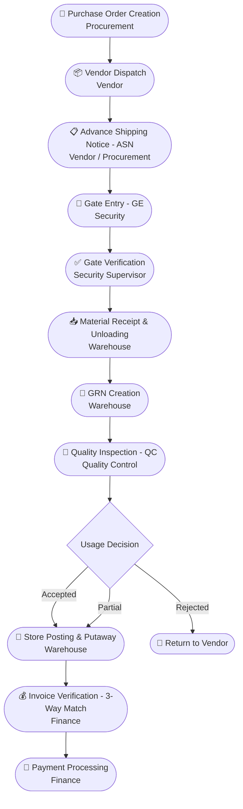

# ERP Inward Material Process — Detailed Documentation

> **Version:** 1.0  
> **Date:** March 2026  
> **Scope:** Full inward lifecycle from Purchase Order creation to vendor payment settlement

---

## Table of Contents

1. [Overview](#1-overview)
2. [Departments Involved](#2-departments-involved)
3. [Process Flow Diagram](#3-process-flow-diagram)
4. [Stage 1 — Purchase Order Creation](#4-stage-1--purchase-order-creation)
5. [Stage 2 — Advance Shipping Notice (ASN)](#5-stage-2--advance-shipping-notice-asn)
6. [Stage 3 — Gate Entry (GE)](#6-stage-3--gate-entry-ge)
7. [Stage 4 — Gate Verification](#7-stage-4--gate-verification)
8. [Stage 5 — Material Receipt & Unloading (MR)](#8-stage-5--material-receipt--unloading-mr)
9. [Stage 6 — Goods Receipt Note (GRN)](#9-stage-6--goods-receipt-note-grn)
10. [Stage 7 — Quality Check (QC)](#10-stage-7--quality-check-qc)
11. [Stage 8 — Store Posting & Putaway](#11-stage-8--store-posting--putaway)
12. [Stage 9 — Invoice Verification (3-Way Match)](#12-stage-9--invoice-verification-3-way-match)
13. [Stage 10 — Payment Processing](#13-stage-10--payment-processing)
14. [ERP Documents Generated](#14-erp-documents-generated)
15. [Key ERP Control Points](#15-key-erp-control-points)
16. [Role of Production Planning & Control (PPC)](#16-role-of-production-planning--control-ppc)

---

## 1. Overview

The **ERP Inward Process** manages the complete lifecycle of materials received from vendors into the organization's warehouse and inventory system.

It ensures:

- **Accurate inventory recording** — every unit is counted and digitally registered.
- **Quality inspection** — no material enters production without QC approval.
- **Procurement validation** — receipts are always linked to authorised Purchase Orders.
- **Financial verification** — payments are made only for goods ordered and received.
- **Full traceability** — every item can be traced from the gate to the storage bin.

The process is **cross-functional**, spanning six departments operating sequentially within the ERP system.

---

## 2. Departments Involved

| #   | Department                              | Primary Responsibility                                          |
| --- | --------------------------------------- | --------------------------------------------------------------- |
| 1   | **Procurement / Purchasing**            | Creates Purchase Orders; coordinates vendor deliveries          |
| 2   | **Security / Gate Office**              | Controls vehicle entry; verifies documents                      |
| 3   | **Stores / Warehouse**                  | Unloads materials; performs quantity verification; stores goods |
| 4   | **Quality Control (QC/QA)**             | Inspects incoming materials; issues acceptance or rejection     |
| 5   | **Finance / Accounts Payable**          | Verifies supplier invoices; processes payments                  |
| 6   | **Production Planning & Control (PPC)** | Adjusts production schedules based on GRN / stock availability  |

---

## 3. Process Flow Diagram



---

## 4. Stage 1 — Purchase Order Creation

**Department:** Procurement / Purchasing  
**ERP Module:** Purchase Management

### Purpose

The inward process begins when Procurement raises an authorised **Purchase Order (PO)** in the ERP. The PO is the primary reference document for all subsequent stages.

### Standard PO Sections

#### 4.1 Document Header

| Field                     | Description                                   |
| ------------------------- | --------------------------------------------- |
| PO Number                 | Unique tracking identifier (system-generated) |
| PO Date                   | Date the order was raised                     |
| Vendor / Supplier Details | Name, address, contact person, GSTIN          |
| Billing Address           | Address where vendor should send the invoice  |
| Ship-to Address           | Specific warehouse or plant for delivery      |
| Currency                  | Transaction currency (e.g., INR, USD)         |
| Payment Terms             | Agreed timeframe (e.g., Net 30, COD)          |

#### 4.2 Line Item Details

| Field                     | Description                                            |
| ------------------------- | ------------------------------------------------------ |
| Item / Product Code (SKU) | Unique identifier from the Material Master             |
| Product Description       | Name and technical specifications (size, grade, model) |
| Quantity                  | Number of units ordered                                |
| Unit of Measure (UOM)     | e.g., Kg, Litre, Pcs                                   |
| Unit Price                | Negotiated cost per unit                               |
| Line Total                | Quantity × Unit Price                                  |
| Delivery Date             | Expected or required arrival date per line item        |
| Tax Code                  | Applicable GST / VAT rate for each item                |

#### 4.3 Footer & Summary

| Field                      | Description                                      |
| -------------------------- | ------------------------------------------------ |
| Subtotal                   | Total before taxes and discounts                 |
| Discounts                  | Agreed price reductions                          |
| Freight / Shipping Charges | Transportation cost                              |
| Grand Total                | Final payable amount (all taxes & fees included) |
| Terms & Conditions         | Legal clauses — quality, returns & warranties    |
| Authorized Signatory       | Digital or physical approval signature           |

> [!IMPORTANT]
> The PO is sent to the vendor and acts as the **legal contract** for the transaction. No delivery should be accepted without a valid, open PO reference.

---

## 5. Stage 2 — Advance Shipping Notice (ASN)

**Department:** Vendor → Procurement  
**ERP Module:** Inbound Logistics / Procurement

### Purpose

Before dispatching, the vendor sends an **ASN** to give the warehouse early visibility of the incoming shipment. This minimizes receiving delays and improves planning.

### ERP Actions on ASN Receipt

- Create shipment record in the system.
- Link the shipment to the corresponding Purchase Order.
- Notify the warehouse receiving team via dashboard/alert.

### Standard ASN Fields

#### 5.1 Shipment Header ("When & Where")

| Field                           | Example Value             |
| ------------------------------- | ------------------------- |
| ASN Number                      | ASN-99201                 |
| Shipment Date & Time            | 2024-10-25, 09:00 AM      |
| Estimated Time of Arrival (ETA) | 2024-10-26, 02:00 PM      |
| Ship-From Address               | Vendor warehouse location |
| Ship-To Address                 | Plant / Warehouse Dock    |
| Carrier / Transporter           | BlueDart Logistics        |
| Tracking / Pro Number           | BL-449201                 |
| Vehicle / Container Number      | MH-04-EY-1234             |

#### 5.2 Order References ("Why")

| Field              | Example Value                      |
| ------------------ | ---------------------------------- |
| PO Number          | PO-2023-005                        |
| Customer Reference | Internal project / department code |

#### 5.3 Item & Packaging Details ("What")

| Field                    | Example Value          |
| ------------------------ | ---------------------- |
| Pallet / Crate ID (SSCC) | PLT-001, PLT-002       |
| Item Code (SKU)          | RM-STEEL-001           |
| Item Description         | Cold Rolled Steel Coil |
| Quantity Shipped         | 500 KG                 |
| Unit of Measure (UOM)    | KG                     |
| Lot / Batch Number       | BATCH-OCT-23           |
| Gross / Net Weight       | 520 KG / 500 KG        |

---

## 6. Stage 3 — Gate Entry (GE)

**Department:** Security / Gate Office  
**ERP Module:** Gate Management

### Core Objective

Security does **not** check material quality. Their role is to verify **identity, documentation, and timing**, and to prevent unauthorised goods from entering the premises.

### Step-by-Step Workflow

1. **Vehicle Identification** — Guard records the vehicle plate number and verifies the driver's ID.
2. **Document Collection** — Guard collects:
   - Vendor Invoice
   - Delivery Challan (DC)
   - E-Way Bill
3. **ERP Search:**
   - _With ASN:_ Guard scans QR code / enters ASN number → all details auto-populate.
   - _Without ASN:_ Guard searches the system using the PO number from vendor paperwork.
4. **Weighbridge Integration** _(if applicable)_ — Gross weight of loaded truck is captured directly into the Gate Entry record.
5. **Entry Creation** — Guard clicks "Submit." The ERP generates a unique **Gate Entry Number (GE-YYYY-0001)**.
6. **Gate Pass Issuance** — A physical or digital slip is handed to the driver to proceed to the Unloading Dock.

### Standard Gate Entry Fields (Security Screen)

| Field Name           | Description                                |
| -------------------- | ------------------------------------------ |
| GE Number            | System-generated unique ID — auto-assigned |
| Date & Time In       | Auto-captured timestamp of arrival         |
| Vendor Name          | Auto-selected via PO or ASN link           |
| Vehicle Number       | Plate number of the truck / lorry          |
| Transporter Name     | Name of the logistics company              |
| Driver Name & Phone  | For security and contact purposes          |
| Challan / Invoice No | Reference number from vendor's paperwork   |
| PO Reference         | Linked Purchase Order number               |
| Material Type        | Raw Material / Consumable / Capital Goods  |
| Gross Weight         | Initial weight of the loaded vehicle       |

### Downstream Impact

| Department     | Effect                                                                                     |
| -------------- | ------------------------------------------------------------------------------------------ |
| **Warehouse**  | Sees "Vehicle X at Gate — Ready for Unloading" on their dashboard                          |
| **Purchasing** | Confirms vendor has fulfilled delivery timeline                                            |
| **Inventory**  | Goods show as **In-Transit / At Gate** — not in stock yet, but company owns responsibility |

---

## 7. Stage 4 — Gate Verification

**Department:** Senior Security Officer / Gate Supervisor  
**ERP Module:** Gate Management

### Purpose

Gate Verification is the **"second eye"** check. While Gate Entry records that a vehicle is present, Gate Verification confirms the truck is **authorized and safe to move to the unloading bay**.

### Step-by-Step Workflow

1. **Physical vs. Digital Document Check** — Supervisor compares physical Invoice / Delivery Challan stamps and signatures against the digital Gate Entry.
2. **PO Status Validation** — ERP checks if the linked PO is still "Open." A cancelled or fully received PO will **block** the verification and flag an unauthorized delivery.
3. **Visual Inspection (External)** — Brief external check of container seals and packaging. Seal number is recorded in the ERP.
4. **Weighbridge Verification** _(Tare Weight)_ — After unloading, empty truck returns to gate. Supervisor records Tare Weight:
   ```
   Net Material Weight = Gross Weight − Tare Weight
   ```
   If Net Weight deviates from Invoice weight beyond tolerance (e.g., ±0.5%), the ERP **flags** it for investigation.

### Gate Verification Fields in ERP

| Field Name       | Action / Purpose                                              |
| ---------------- | ------------------------------------------------------------- |
| Verify GE Number | Pulls up the original Gate Entry record                       |
| Seal Number      | Records the lead / plastic seal ID of the container           |
| Document Match   | Checkbox confirming Paper Invoice = System PO                 |
| Security Remarks | Notes on vehicle condition (e.g., "Tarp torn," "Seal broken") |
| Approval Status  | Changes from **Pending** → **Verified / Proceed to Dock**     |
| Timestamp        | Auto-records verification completion time                     |

> [!NOTE]
> **Key Distinction:**
>
> - **Gate Entry** = "A truck has arrived."
> - **Gate Verification** = "The truck is authorized and safe to enter the loading zone."

Once verified, the ERP generates a **Movement Slip / Dock Assignment**, directing the driver to the exact unloading bay.

---

## 8. Stage 5 — Material Receipt & Unloading (MR)

**Department:** Stores / Warehouse  
**ERP Module:** Warehouse Management / Inventory

### Purpose

The **Material Receipt** is the stage where physical goods transfer from the truck to the warehouse floor. The warehouse team formally takes ownership of the materials.

### Unloading Process

1. Vehicle moves to the assigned dock (per Gate Verification).
2. Materials are unloaded via forklifts, conveyors, or manual labour.
3. Goods are staged in a temporary **"Receiving Zone"** — not mixed with existing stock.

### Physical Verification & Counting

| Check                  | Details                                                                                              |
| ---------------------- | ---------------------------------------------------------------------------------------------------- |
| **Quantity Check**     | Count units / boxes or weigh material; compare against Vendor Packing List, Delivery Challan, and PO |
| **Damage Inspection**  | Check for crushed boxes, moisture damage, or broken seals                                            |
| **Internal Labelling** | System generates internal barcodes / QR labels for batch tracking                                    |

### ERP System Actions (MR Screen)

| Field Name                 | Description                                                     |
| -------------------------- | --------------------------------------------------------------- |
| GE Link                    | Storekeeper selects Gate Entry Number → all data auto-populates |
| Unloading Start / End Time | Tracks labour efficiency and dock turnaround                    |
| Received Quantity          | Actual count during unloading (may differ from Invoice)         |
| Shortage / Excess          | ERP auto-calculates: PO Qty − Received Qty                      |
| Rejected On-Arrival        | Quantity returned immediately due to visible damage             |
| Batch / Lot Number         | Vendor's batch number for full traceability                     |
| Storage Bin (Provisional)  | Temporary location in the Staging / Receiving Zone              |

### Short & Excess Delivery Note

When the **Received Quantity** differs from the **Purchase Order Quantity**, the ERP automatically classifies the discrepancy and initiates the appropriate workflow.

#### Quantity Comparison Formula

```
Variance = Received Quantity − PO Quantity

Shortage  → Variance is Negative  (e.g., −10 units)
Excess    → Variance is Positive  (e.g., +15 units)
```

---

#### Short Delivery (Under-Shipment)

A **Short Delivery** occurs when the vendor sends fewer units than ordered.

| Field | Detail |
|-------|--------|
| **Condition** | Received Qty < PO Qty |
| **Example** | PO Qty = 100 KG, Received = 85 KG → Shortage = 15 KG |
| **Tolerance Check** | ERP checks the Under-Delivery Tolerance (e.g., ±3%). If shortage is within tolerance, GRN proceeds normally. |
| **If Within Tolerance** | GRN is created for 85 KG. The PO remains **"Partially Open"** for the remaining 15 KG. |
| **If Beyond Tolerance** | ERP flags the Short Delivery and may block invoice payment for the undelivered quantity. |

**ERP Actions for Short Delivery:**

1. **Partial GRN Created** — Only the received quantity (85 KG) is booked into inventory.
2. **PO Status = Partially Received** — The PO stays open; the vendor can deliver the balance in a subsequent shipment.
3. **Shortage Report Generated** — A system notification is sent to the Procurement team.
4. **Invoice Blocked for Shortage Qty** — Finance cannot pay for 100 KG; only 85 KG is approved for payment until the balance is delivered or a credit note is issued.
5. **Vendor Intimation** — Procurement raises a **Short Delivery Notice** to the vendor requesting the balance delivery or a Credit Note.

| Scenario | Resolution |
|----------|------------|
| Vendor delivers balance in next trip | New Gate Entry → New GRN against same PO |
| Vendor cannot supply balance | Raise a Debit Note / Credit Note; close PO partially |
| Shortage within tolerance and acceptable | GRN posted for received qty; PO closed manually by Procurement |

---

#### Excess Delivery (Over-Shipment)

An **Excess Delivery** occurs when the vendor sends more units than ordered.

| Field | Detail |
|-------|--------|
| **Condition** | Received Qty > PO Qty |
| **Example** | PO Qty = 100 KG, Received = 115 KG → Excess = 15 KG |
| **Tolerance Check** | ERP checks the Over-Delivery Tolerance (e.g., ±5%). If excess is within tolerance, GRN proceeds. |
| **If Within Tolerance** | GRN is created for 115 KG. Invoice is verified for 115 KG (within the allowed limit). |
| **If Beyond Tolerance** | ERP **blocks** the GRN for the excess quantity. The extra material cannot enter inventory without approval. |

**ERP Actions for Excess Delivery:**

1. **GRN Blocked for Excess Qty** — The system prevents posting for units beyond the tolerance limit.
2. **Excess Material Quarantined** — The over-delivered items are moved to a separate **"Excess / Hold Area"** in the warehouse.
3. **Procurement Notified** — ERP alerts procurement to decide: accept the excess (raise a PO amendment) or return to vendor.
4. **Invoice Impact** — Payment is only processed for the PO quantity or the approved received quantity — not the excess.

| Scenario | Resolution |
|----------|------------|
| Excess is within tolerance | GRN posted for full received qty; Invoice verified accordingly |
| Excess is beyond tolerance — accepted by business | Procurement raises a **PO Amendment** to increase qty; GRN then updated |
| Excess is beyond tolerance — not accepted | Excess material returned to vendor; **Return to Vendor (RTV)** document raised |

---

> [!WARNING]
> **Neither short nor excess materials should be accepted without proper ERP documentation.** Accepting excess without a PO amendment inflates inventory without a valid financial commitment. Accepting a short delivery without recording the variance leads to incorrect stock levels and incorrect vendor payments.

---

### Inventory Status at This Stage

> [!IMPORTANT]
> After Material Receipt, stock status is set to **"In-Quality" / "Restricted Stock"** — visible in the system so Production knows it has arrived, but **NOT available for consumption** until QC approval.

### Position in the 3-Way Match

```
1. Purchase Order   — What we asked for
2. Material Receipt — What we actually got  ← You are here
3. Vendor Invoice   — What they are charging us
```

---

## 9. Stage 6 — Goods Receipt Note (GRN)

**Department:** Stores / Warehouse  
**ERP Module:** Inventory Management / Finance

### Core Purpose of GRN

| Role                    | Description                                                  |
| ----------------------- | ------------------------------------------------------------ |
| **Legal Evidence**      | Officially confirms the company has accepted the goods       |
| **Inventory Update**    | Increases "Stock on Hand" (in Restricted status pending QC)  |
| **Financial Liability** | Triggers the accounting entry: company now owes vendor money |

### GRN Workflow in ERP

1. **Selection** — Storekeeper opens the MR or Gate Entry record.
2. **Validation** — ERP auto-compares received quantity against the PO.
3. **Tolerance Check** — If received quantity exceeds PO (e.g., 105 vs. 100 ordered), the ERP checks the Over-Delivery Tolerance. If exceeded (e.g., >5%), the GRN is **blocked**.
4. **Automated Accounting Entry** — On saving the GRN:
   ```
   Debit:  Inventory Account (or GR/IR Clearing Account)
   Credit: Accounts Payable (Vendor Liability)
   ```

### Standard GRN Fields in ERP

| Field Name            | Description                                          |
| --------------------- | ---------------------------------------------------- |
| GRN Number            | Unique, non-editable system ID (e.g., GRN/24-25/089) |
| GRN Date              | Date goods are officially entered into books         |
| Posting Date          | Date used for financial ledger updates               |
| Accepted Quantity     | Quantity physically counted and verified             |
| UOM (Unit of Measure) | Must match the PO (e.g., MT, KG, Nos)                |
| Batch / Lot Number    | Used for expiry and manufacturing date tracking      |
| Warehouse / Bin       | Physical storage location of goods                   |
| Valuation             | Price fetched from PO to calculate stock value       |

### GRN Statuses

| Status              | Description                                        |
| ------------------- | -------------------------------------------------- |
| **Provisional GRN** | Created after unloading, before QC approval        |
| **Final GRN**       | Updated once Quality Control approves the material |

### Digital Thread (Document Chain)

```
Purchase Order → Gate Entry → Material Receipt → GRN → Quality Inspection
```

> [!NOTE]
> Saving the GRN **automatically triggers** a Quality Inspection Lot, notifying the QC lab that samples are ready for testing.

---

## 10. Stage 7 — Quality Check (QC)

**Department:** Quality Control / Quality Assurance  
**ERP Module:** Quality Management

### Purpose

QC acts as the **"Filter"**. Even though goods are physically in the warehouse, the ERP keeps them in **Restricted / Quarantine** status until QC issues a Usage Decision.

### QC Workflow in ERP

1. **Automatic Lot Generation** — GRN triggers an Inspection Lot with a real-time notification to QC's dashboard.
2. **Sampling** — QC technicians take physical samples based on the Sampling Plan defined in the Material Master (e.g., 10% of boxes or √n of total quantity).
3. **Testing** — Lab performs tests: chemical composition, dimensions, moisture, tensile strength, etc.
4. **Result Recording** — Technician enters actual values against predefined Standard Specifications in the ERP's Quality Module.

### The "Usage Decision" (Critical Step)

| Decision                              | ERP Action                                                                                                             |
| ------------------------------------- | ---------------------------------------------------------------------------------------------------------------------- |
| **Accepted (Clearance)**              | Stock → **Unrestricted**. Available for production issue / consumption.                                                |
| **Rejected**                          | Stock → **Blocked**. ERP prevents production use. Rejection Note generated; RTV (Return to Vendor) workflow triggered. |
| **Conditional Acceptance (Deviated)** | Material usable but non-conforming. Requires approval override from Production / Technical Head.                       |

### Standard QC Fields in ERP

| Field Name                    | Description                                        |
| ----------------------------- | -------------------------------------------------- |
| Inspection Lot ID             | Unique ID linked to the GRN                        |
| Sample Size                   | Quantity physically taken for testing              |
| Parameter Name                | Specific test (e.g., "Purity %" or "Hardness")     |
| Standard Value                | Target specification (e.g., 99.5%–100%)            |
| Observed Value                | Actual lab result                                  |
| Usage Decision (UD)           | Final status: Approved / Rejected / Rework         |
| Certificate of Analysis (COA) | Attachment field for vendor or internal lab report |

### Impact on Inventory & Finance

| Area          | Effect                                                                                                 |
| ------------- | ------------------------------------------------------------------------------------------------------ |
| **Inventory** | Only "Accepted" stock increases usable inventory levels                                                |
| **Finance**   | Rejected material triggers automatic hold on Vendor Invoice until replacement or credit note is issued |

---

## 11. Stage 8 — Store Posting & Putaway

**Department:** Warehouse  
**ERP Module:** Warehouse Management (WM)

### Purpose

This is the **final physical movement** of the inward process — transitioning material from the temporary Staging Area to its permanent home in the warehouse, making it officially available for production.

### Workflow

1. **Transfer Posting** — ERP performs a system movement from Quality/Restricted Stock → Unrestricted/Available Stock.
2. **Putaway Task Generation** — WM module generates a "Putaway Task" / Transfer Order instructing the operator on the destination bin.
3. **Physical Placement** — Operator moves pallets / boxes to the designated bin.
4. **Confirmation** — Operator scans both the Bin Location barcode and the Item barcode to confirm correct placement.

### Putaway Strategies (ERP Logic)

| Strategy                     | Description                                         |
| ---------------------------- | --------------------------------------------------- |
| **Manual Entry**             | Storekeeper selects bin based on experience         |
| **Fixed Bin**                | Item always goes to the same pre-assigned location  |
| **Empty Bin Strategy**       | System finds nearest empty space to optimise volume |
| **FIFO / FEFO Optimisation** | Oldest stock positioned to be picked first          |

### Standard Store Posting & Putaway Fields

| Field Name          | Description                                         |
| ------------------- | --------------------------------------------------- |
| Material ID         | Unique code of the raw material                     |
| Batch / Lot No.     | Linked to QC approval for full traceability         |
| Source Bin          | Temporary "Receiving Zone" current location         |
| Destination Bin     | Specific Rack, Row & Level (e.g., RACK-A1-L2)       |
| Quantity            | Exact count being moved into storage                |
| Putaway Date / Time | Timestamp when item became available for production |
| Operator ID         | Tracks the employee who performed transport         |

### Business Impact

| Stakeholder             | Impact                                                                |
| ----------------------- | --------------------------------------------------------------------- |
| **Production Planning** | Stock visible as "Available"; Material Requisitions can now be raised |
| **Inventory Accuracy**  | Exact bin location ensures efficient picking                          |
| **Audit Readiness**     | Clear digital trail from Gate Entry → specific Rack                   |

---

## 12. Stage 9 — Invoice Verification (3-Way Match)

**Department:** Finance / Accounts Payable  
**ERP Module:** Finance / Accounts Payable

### Purpose

Invoice Verification is the **"Financial Handshake."** It ensures the company pays only for what was ordered **and** actually received in good condition.

### The 3-Way Match (Golden Rule)

```
1. Purchase Order (PO)        → Did we agree to this price and quantity?
2. Goods Receipt Note (GRN)   → Did we actually receive this quantity?
3. Vendor Invoice              → Is the vendor charging us correctly?
```

### Workflow

1. **Invoice Receipt (IR)** — Vendor sends physical or digital invoice. AP clerk enters details into the Invoice Verification screen.
2. **System Linking** — Clerk enters PO or GRN number; ERP auto-pulls quantities and prices.
3. **Discrepancy Check (Tolerance):**
   - Invoice Price > PO Price → **Price Variance** flag.
   - Invoice Qty > GRN Qty → **Quantity Variance** flag.
4. **Tax Validation** — ERP calculates GST/VAT from PO tax codes and compares against vendor's calculation.
5. **Blocked for Payment** — Any out-of-tolerance mismatch blocks the invoice until a Credit Note is received or discrepancy is resolved.
6. **Posting** — Once verified, provisional liability (created at GRN) converts to Final Vendor Liability.

### Standard Invoice Verification Fields

| Field Name         | Source / Purpose                               |
| ------------------ | ---------------------------------------------- |
| Invoice Number     | Unique ID from vendor's bill                   |
| Invoice Date       | Used to calculate Due Date from credit terms   |
| Reference GRN / PO | Link to physical receipt and original contract |
| Billed Quantity    | Quantity vendor claims to have sent            |
| Unit Price         | Must match negotiated PO price                 |
| Tax Amount         | Calculated from HSN / Tax code                 |
| Total Payable      | Final amount to be paid                        |
| Discount           | Early payment or trade discounts applied       |

### Financial Accounting Entry

```
Debit:  GR/IR Clearing Account  (clears the temporary GRN entry)
Credit: Vendor Main Account      (sets up the final liability to the supplier)
```

---

## 13. Stage 10 — Payment Processing

**Department:** Finance  
**ERP Module:** Finance / Treasury

### Purpose

Payment Processing settles the company's liability. The **digital thread** that started with a Purchase Order ends here with a bank transaction.

### Payment Workflow

1. **Payment Selection (Due Date Monitoring)** — Finance runs a "Payment Suggestion" report. ERP identifies all verified invoices that have reached their credit terms (e.g., Net 30/45 from GRN date).
2. **Payment Proposal** — ERP generates a vendor payment list. Finance reviews for:
   - **Debit Notes** — QC rejections or quantity shortages to be deducted.
   - **Advances** — Prior advance payments to be adjusted.
   - **Discounts** — Early payment discounts, if applicable.
3. **Approval Workflow** — Proposal is digitally routed to Finance Manager / CFO for electronic approval within the ERP (amount-based routing).
4. **Execution (Payment Run)** — ERP connects to the company's bank via Host-to-Host (H2H) or API and initiates transfer (NEFT, RTGS, Wire).
5. **Reconciliation** — ERP marks Invoice as **"Cleared"** and auto-generates a **Payment Advice** emailed to the vendor.

### Standard Payment Fields in ERP

| Field Name          | Description                                             |
| ------------------- | ------------------------------------------------------- |
| Payment Reference   | Unique transaction ID (e.g., UTR Number)                |
| Vendor Bank Details | Auto-fetched from Vendor Master (IBAN / SWIFT / IFSC)   |
| Payment Method      | Bank Transfer / Cheque / NEFT / RTGS / Letter of Credit |
| Gross Amount        | Total amount verified in the invoice                    |
| Deductions          | TDS, Retentions, or Debit Notes                         |
| Net Paid Amount     | Final amount actually transferred to vendor             |
| Value Date          | Date money leaves the company's account                 |

### Final Accounting Entry

```
Debit:  Vendor Main Account  (decreases the liability)
Credit: Bank Account          (decreases the company's cash asset)
```

### Supported Payment Modes

| Mode                 | Use Case                                        |
| -------------------- | ----------------------------------------------- |
| Bank Transfer / NEFT | Standard domestic transfers                     |
| RTGS                 | High-value same-day transfers                   |
| Cheque               | Where electronic is not possible                |
| Automated Platforms  | e.g., Tipalti for multi-currency / cross-border |

---

## 14. ERP Documents Generated

| #   | Document                             | Created By                              |
| --- | ------------------------------------ | --------------------------------------- |
| 1   | **Purchase Order (PO)**              | Procurement                             |
| 2   | **Advance Shipping Notice (ASN)**    | Vendor (Procurement receives)           |
| 3   | **Gate Entry Record**                | Security                                |
| 4   | **Gate Entry Slip / Movement Slip**  | Security (internal tracking)            |
| 5   | **Material Receipt Note (MRN)**      | Warehouse                               |
| 6   | **Goods Receipt Note (GRN)**         | Warehouse                               |
| 7   | **Inspection Lot**                   | Auto-generated (on GRN save)            |
| 8   | **QC Inspection Report**             | Quality Control                         |
| 9   | **Rejection Note**                   | Quality Control (for rejected material) |
| 10  | **Putaway Task / Transfer Order**    | Warehouse Management System             |
| 11  | **Vendor Invoice**                   | Vendor                                  |
| 12  | **Payment Voucher / Payment Advice** | Finance                                 |

---

## 15. Key ERP Control Points

| Control Point                     | Purpose                                                                   |
| --------------------------------- | ------------------------------------------------------------------------- |
| **PO-Based Receiving**            | Prevents unauthorized deliveries — no GRN without an open PO              |
| **Quality Inspection Before Use** | Blocks production consumption until QC approves the stock                 |
| **3-Way Invoice Matching**        | Prevents overpayments, duplicate payments, and fraud                      |
| **Over/Under Delivery Tolerance** | Blocks GRN or Invoice if quantity deviates beyond set thresholds          |
| **Warehouse Bin Tracking**        | Precise inventory location for picking accuracy and cycle counts          |
| **Vendor Traceability**           | Full audit trail from PO → Gate → GRN → QC → Bin → Payment                |
| **Weighbridge Integration**       | Validates material weight against invoice and prevents short shipments    |
| **Invoice Blocking**              | Suspends payment when rejected material has not been returned or credited |

---

## 16. Role of Production Planning & Control (PPC)

PPC does **not** physically receive materials, but relies heavily on ERP inward data to drive manufacturing.

| PPC Data Dependency                  | Outcome                                                              |
| ------------------------------------ | -------------------------------------------------------------------- |
| **GRN Status**                       | Confirms a delivery has been received                                |
| **QC Approval (Unrestricted Stock)** | Confirms material is cleared for production use                      |
| **Available Stock Levels**           | Enables Material Requirement Planning (MRP) to schedule works orders |

PPC uses this information to:

- Adjust production schedules proactively.
- Prevent line stoppages due to material unavailability.
- Create Material Requisitions (MRs) for the factory floor.

---

## Summary — Full Inward Cycle at a Glance

| Step | Stage                   | Department          | Key Output                             |
| ---- | ----------------------- | ------------------- | -------------------------------------- |
| 1    | Purchase Order          | Procurement         | Authorised PO in ERP                   |
| 2    | ASN                     | Vendor              | Shipment pre-notification              |
| 3    | Gate Entry              | Security            | GE Number; In-Transit status           |
| 4    | Gate Verification       | Security Supervisor | Movement Slip to dock                  |
| 5    | Material Receipt        | Warehouse           | Quantity count; Restricted stock       |
| 6    | GRN Creation            | Warehouse           | GRN Number; Financial liability raised |
| 7    | Quality Check           | QC                  | Usage Decision; Unrestricted stock     |
| 8    | Store Posting & Putaway | Warehouse           | Bin assignment; Available stock        |
| 9    | Invoice Verification    | Finance             | 3-Way Match; Final vendor liability    |
| 10   | Payment Processing      | Finance             | Bank transfer; Invoice cleared         |

---

_End of Document — ERP Inward Material Process v1.0_
