# ERP Inward Material Process — System Architecture & Design

> **Version:** 1.0 | **Date:** March 2026  
> **Scope:** Full system design covering application layers, module interactions, data flows, database schema, API design, RBAC, and integrations.

---

## Table of Contents

1. [Architecture Overview](#1-architecture-overview)
2. [Technology Stack](#2-technology-stack)
3. [Application Layer Architecture](#3-application-layer-architecture)
4. [ERP Module Map](#4-erp-module-map)
5. [End-to-End Data Flow](#5-end-to-end-data-flow)
6. [Sequence Diagrams by Stage](#6-sequence-diagrams-by-stage)
7. [Database Schema (ERD)](#7-database-schema-erd)
8. [API Design](#8-api-design)
9. [Role-Based Access Control (RBAC)](#9-role-based-access-control-rbac)
10. [Document Generation Pipeline](#10-document-generation-pipeline)
11. [External Integrations](#11-external-integrations)
12. [System States & Transitions](#12-system-states--transitions)

---

## 1. Architecture Overview

The ERP Inward system follows a **multi-tier, modular architecture** with clear separation of concerns across six functional domains.

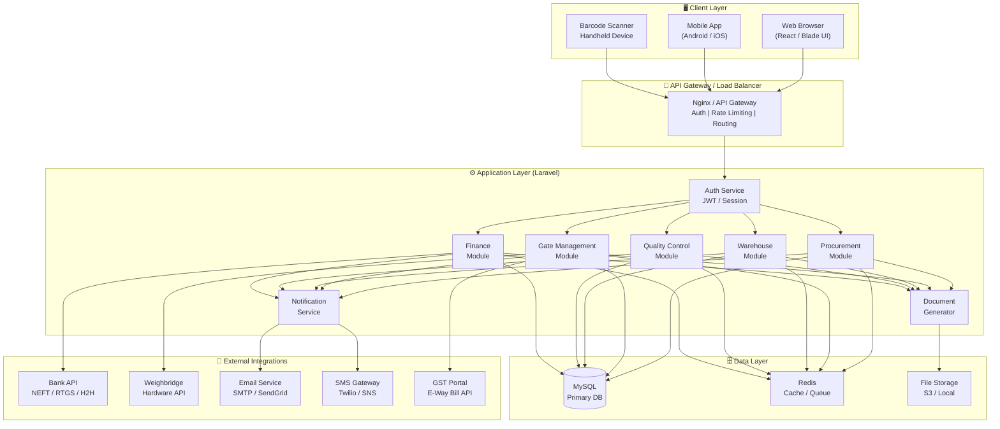

---

## 2. Technology Stack

| Layer | Technology | Purpose |
|-------|-----------|---------|
| **Frontend** | Laravel Blade + Alpine.js / React | UI for all departments |
| **Backend** | Laravel 11 (PHP 8.3) | Business logic & API |
| **Database** | MySQL 8.0 | Relational data storage |
| **Cache / Queue** | Redis | Session cache, job queues, notifications |
| **File Storage** | AWS S3 / Local Disk | GRN PDFs, QC reports, invoices |
| **Web Server** | Nginx + PHP-FPM | HTTP server |
| **Auth** | Laravel Sanctum / JWT | API token authentication |
| **PDF Generation** | DomPDF / Snappy | GRN, PO, Payment Voucher PDFs |
| **Queue Worker** | Laravel Horizon | Background jobs (notifications, auto-postings) |
| **Email** | SMTP / Mailgun | Notifications, Payment Advice |
| **Barcode** | ZXing / BarcodeJS | Label scanning & generation |

---

## 3. Application Layer Architecture

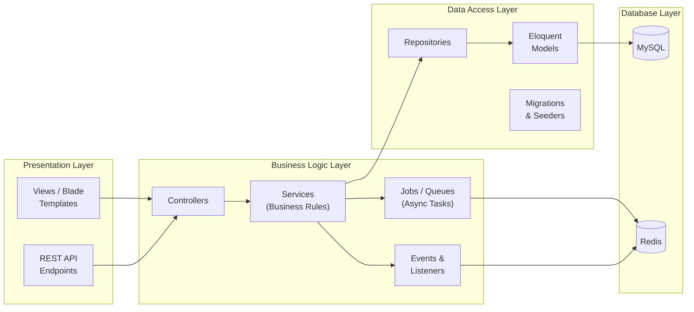

### Key Design Principles

| Principle | Implementation |
|-----------|---------------|
| **Single Responsibility** | One Service class per business domain (GrnService, QcService, etc.) |
| **Event-Driven** | Stage transitions fire Laravel Events (GrnSaved → QcInspectionLotCreated) |
| **Queue-First** | Notifications, PDF generation, and bank transfers run as background Jobs |
| **Repository Pattern** | All DB queries abstracted via Repositories for testability |
| **Soft Deletes** | All master and transactional records use `deleted_at` for audit trails |

---

## 4. ERP Module Map

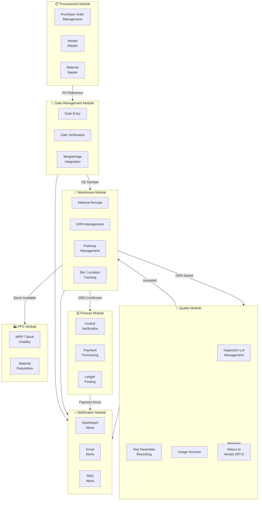

---

## 5. End-to-End Data Flow

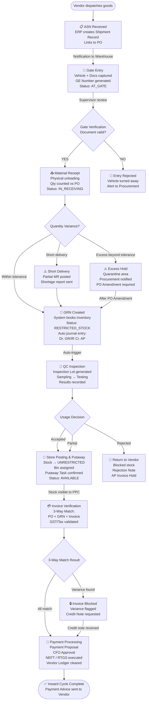

---

## 6. Sequence Diagrams by Stage

### 6.1 Gate Entry → GRN Sequence

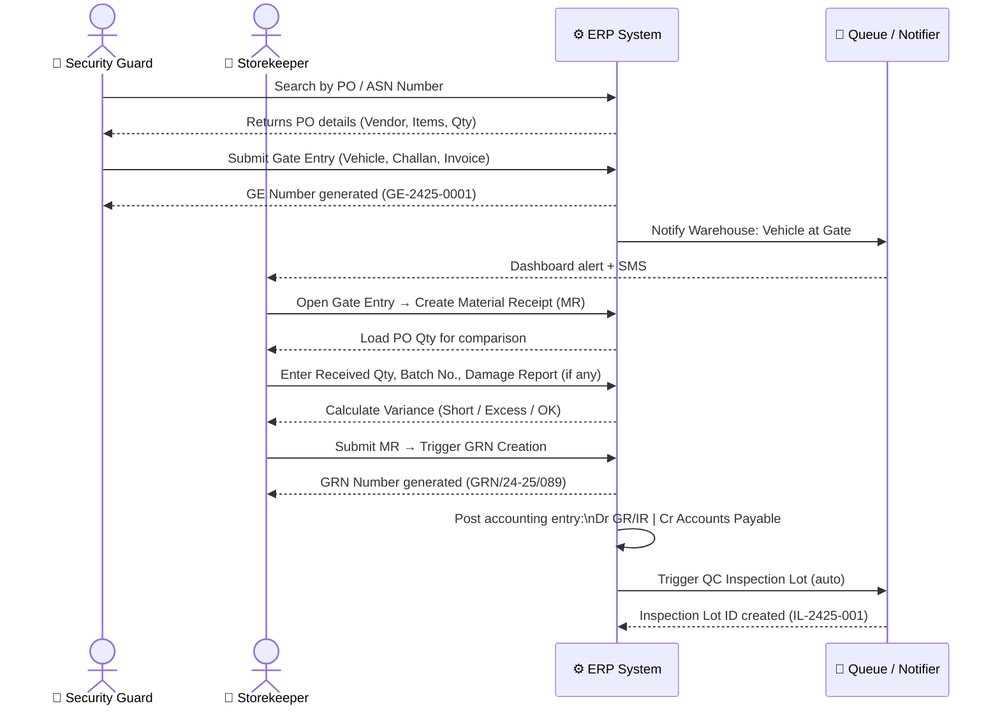

### 6.2 QC → Putaway → Finance Sequence

```mermaid
sequenceDiagram
    actor QC as 🔬 QC Inspector
    actor Store as 🏪 Storekeeper
    actor AP as 💰 AP Clerk
    participant ERP as ⚙️ ERP System
    participant Bank as 🏦 Bank API

    QC->>ERP: Open Inspection Lot, record test results
    QC->>ERP: Submit Usage Decision (Accepted / Rejected)
    alt Accepted
        ERP->>ERP: Stock Status: RESTRICTED → UNRESTRICTED
        ERP-->>Store: Putaway Task generated
        Store->>ERP: Confirm bin placement (scan bin barcode)
        ERP->>ERP: Bin location updated; Stock = AVAILABLE
        ERP-->>AP: GRN finalised — ready for invoice matching
    else Rejected
        ERP->>ERP: Stock → BLOCKED
        ERP-->>AP: Invoice Hold triggered
        ERP-->>Store: Return to Vendor task raised
    end

    AP->>ERP: Enter Vendor Invoice details
    ERP->>ERP: 3-Way Match (PO + GRN + Invoice)
    alt Match Passed
        AP->>ERP: Post Invoice
        ERP->>ERP: Dr GR/IR Cr Vendor Account (final liability)
        AP->>ERP: Submit Payment Proposal
        ERP-->>AP: CFO Approval workflow triggered
        AP->>ERP: Approved → Execute Payment Run
        ERP->>Bank: Initiate NEFT / RTGS Transfer
        Bank-->>ERP: UTR Number returned
        ERP->>ERP: Mark Invoice CLEARED
        ERP-->>AP: Payment Advice generated + emailed to vendor
    else Match Failed
        ERP-->>AP: Invoice Blocked — Variance report shown
    end
```

---

## 7. Database Schema (ERD)

### 7.1 Core Tables Overview

```mermaid
erDiagram
    purchase_orders {
        bigint id PK
        string po_number UK
        bigint vendor_id FK
        string status
        date po_date
        date expected_delivery
        string payment_terms
        decimal total_amount
        string currency
        timestamps created_at
    }

    po_line_items {
        bigint id PK
        bigint po_id FK
        bigint material_id FK
        decimal ordered_qty
        string uom
        decimal unit_price
        decimal line_total
        string tax_code
        date delivery_date
    }

    vendor_master {
        bigint id PK
        string vendor_code UK
        string name
        string gstin
        string address
        string bank_ifsc
        string bank_account
        string contact_email
        string contact_phone
        boolean is_active
    }

    material_master {
        bigint id PK
        string material_code UK
        string description
        string category
        string uom
        string hsn_code
        decimal under_del_tolerance
        decimal over_del_tolerance
        boolean qc_required
    }

    asn_header {
        bigint id PK
        string asn_number UK
        bigint po_id FK
        bigint vendor_id FK
        date ship_date
        datetime eta
        string carrier_name
        string vehicle_number
        string tracking_number
        string status
    }

    gate_entries {
        bigint id PK
        string ge_number UK
        bigint asn_id FK
        bigint po_id FK
        bigint vendor_id FK
        string vehicle_number
        string driver_name
        string driver_phone
        string challan_number
        string eway_bill
        decimal gross_weight
        datetime arrived_at
        string status
        bigint created_by FK
    }

    gate_verifications {
        bigint id PK
        bigint ge_id FK
        string seal_number
        boolean doc_match
        decimal tare_weight
        decimal net_weight
        string remarks
        string approval_status
        datetime verified_at
        bigint verified_by FK
    }

    material_receipts {
        bigint id PK
        string mr_number UK
        bigint ge_id FK
        bigint po_id FK
        datetime unloading_start
        datetime unloading_end
        string status
        bigint created_by FK
    }

    mr_line_items {
        bigint id PK
        bigint mr_id FK
        bigint po_line_id FK
        bigint material_id FK
        decimal received_qty
        decimal shortage_qty
        decimal excess_qty
        decimal rejected_on_arrival
        string batch_number
        string provisional_bin
        string damage_remarks
    }

    grn_header {
        bigint id PK
        string grn_number UK
        bigint mr_id FK
        bigint po_id FK
        bigint vendor_id FK
        date grn_date
        date posting_date
        string status
        bigint created_by FK
    }

    grn_line_items {
        bigint id PK
        bigint grn_id FK
        bigint mr_line_id FK
        bigint material_id FK
        decimal accepted_qty
        string uom
        string batch_number
        decimal unit_price
        decimal line_value
        string warehouse_bin
    }

    inspection_lots {
        bigint id PK
        string lot_number UK
        bigint grn_id FK
        bigint material_id FK
        decimal sample_size
        string status
        bigint assigned_to FK
    }

    inspection_results {
        bigint id PK
        bigint lot_id FK
        string parameter_name
        string standard_value
        string observed_value
        boolean is_pass
    }

    usage_decisions {
        bigint id PK
        bigint lot_id FK
        string decision
        decimal accepted_qty
        decimal rejected_qty
        string remarks
        string coa_file_path
        datetime decided_at
        bigint decided_by FK
    }

    putaway_tasks {
        bigint id PK
        bigint grn_line_id FK
        bigint material_id FK
        string batch_number
        decimal quantity
        string source_bin
        string destination_bin
        string status
        datetime completed_at
        bigint operator_id FK
    }

    vendor_invoices {
        bigint id PK
        string invoice_number UK
        bigint vendor_id FK
        bigint grn_id FK
        bigint po_id FK
        date invoice_date
        date due_date
        decimal billed_qty
        decimal unit_price
        decimal tax_amount
        decimal discount
        decimal total_payable
        string match_status
        string payment_status
    }

    payments {
        bigint id PK
        string payment_reference UK
        bigint invoice_id FK
        bigint vendor_id FK
        string payment_method
        decimal gross_amount
        decimal deductions
        decimal net_paid
        date value_date
        string utr_number
        string status
        bigint approved_by FK
    }

    purchase_orders ||--o{ po_line_items : "has"
    purchase_orders }o--|| vendor_master : "from"
    po_line_items }o--|| material_master : "for"
    purchase_orders ||--o{ asn_header : "notified via"
    asn_header ||--|| gate_entries : "triggers"
    gate_entries ||--|| gate_verifications : "verified by"
    gate_entries ||--|| material_receipts : "leads to"
    material_receipts ||--o{ mr_line_items : "contains"
    mr_line_items }o--|| po_line_items : "references"
    material_receipts ||--|| grn_header : "posts as"
    grn_header ||--o{ grn_line_items : "contains"
    grn_header ||--o{ inspection_lots : "triggers"
    inspection_lots ||--o{ inspection_results : "records"
    inspection_lots ||--|| usage_decisions : "results in"
    grn_line_items ||--o{ putaway_tasks : "generates"
    grn_header ||--|| vendor_invoices : "matched with"
    vendor_invoices ||--|| payments : "settled by"
```

### 7.2 Key Table: `purchase_orders`

| Column | Type | Constraint | Description |
|--------|------|-----------|-------------|
| `id` | BIGINT | PK, AI | Internal ID |
| `po_number` | VARCHAR(30) | UNIQUE | e.g., PO-2425-00123 |
| `vendor_id` | BIGINT | FK → vendor_master | Supplier reference |
| `status` | ENUM | NOT NULL | `DRAFT`, `OPEN`, `PARTIALLY_RECEIVED`, `FULLY_RECEIVED`, `CLOSED`, `CANCELLED` |
| `po_date` | DATE | NOT NULL | Creation date |
| `expected_delivery` | DATE | NULL | Expected arrival date |
| `payment_terms` | VARCHAR(50) | NOT NULL | e.g., `Net30`, `COD` |
| `total_amount` | DECIMAL(15,2) | NOT NULL | Grand total |
| `currency` | VARCHAR(3) | DEFAULT `INR` | Currency code |
| `created_by` | BIGINT | FK → users | Creator |
| `approved_by` | BIGINT | FK → users | Approver |
| `created_at` | TIMESTAMP | AUTO | Record timestamp |

### 7.3 Key Table: `grn_header`

| Column | Type | Constraint | Description |
|--------|------|-----------|-------------|
| `id` | BIGINT | PK, AI | Internal ID |
| `grn_number` | VARCHAR(30) | UNIQUE | e.g., GRN/24-25/089 |
| `mr_id` | BIGINT | FK → material_receipts | Source receipt |
| `po_id` | BIGINT | FK → purchase_orders | PO reference |
| `vendor_id` | BIGINT | FK → vendor_master | Vendor reference |
| `grn_date` | DATE | NOT NULL | Acceptance date |
| `posting_date` | DATE | NOT NULL | Financial posting date |
| `status` | ENUM | NOT NULL | `PROVISIONAL`, `QC_PENDING`, `ACCEPTED`, `REJECTED`, `PARTIAL` |
| `journal_ref` | VARCHAR(50) | NULL | Accounting entry reference |

---

## 8. API Design

### 8.1 REST API Structure

```
Base URL: /api/v1/inward/
```

#### Procurement

| Method | Endpoint | Description |
|--------|----------|-------------|
| `GET` | `/purchase-orders` | List POs (filterable by status, vendor, date) |
| `POST` | `/purchase-orders` | Create new PO |
| `GET` | `/purchase-orders/{id}` | Get PO details with line items |
| `PATCH` | `/purchase-orders/{id}/status` | Update PO status |
| `GET` | `/purchase-orders/{id}/asn` | Get linked ASN |

#### Gate Management

| Method | Endpoint | Description |
|--------|----------|-------------|
| `POST` | `/gate-entries` | Create Gate Entry |
| `GET` | `/gate-entries/{id}` | Get GE details |
| `POST` | `/gate-entries/{id}/verify` | Submit Gate Verification |
| `GET` | `/gate-entries/active` | List vehicles currently at gate |
| `POST` | `/gate-entries/{id}/weighbridge` | Post weighbridge reading |

#### Warehouse / GRN

| Method | Endpoint | Description |
|--------|----------|-------------|
| `POST` | `/material-receipts` | Create Material Receipt from GE |
| `POST` | `/grn` | Create GRN from MR |
| `GET` | `/grn/{id}` | Get GRN with line items |
| `GET` | `/grn/{id}/status` | Get current GRN status |
| `POST` | `/putaway-tasks/{id}/confirm` | Confirm bin placement |

#### Quality Control

| Method | Endpoint | Description |
|--------|----------|-------------|
| `GET` | `/inspection-lots` | QC team dashboard — pending lots |
| `GET` | `/inspection-lots/{id}` | Lot details + parameters |
| `POST` | `/inspection-lots/{id}/results` | Submit test results |
| `POST` | `/inspection-lots/{id}/usage-decision` | Submit Usage Decision |

#### Finance

| Method | Endpoint | Description |
|--------|----------|-------------|
| `POST` | `/vendor-invoices` | Register vendor invoice |
| `GET` | `/vendor-invoices/{id}/match` | Run 3-way match check |
| `POST` | `/vendor-invoices/{id}/post` | Post verified invoice |
| `GET` | `/payments/due` | Payment suggestion report |
| `POST` | `/payments/run` | Execute payment batch |

### 8.2 Standard API Response Format

```json
{
  "success": true,
  "data": { },
  "message": "GRN created successfully",
  "meta": {
    "grn_number": "GRN/24-25/089",
    "status": "PROVISIONAL",
    "next_action": "qc_inspection"
  },
  "errors": null
}
```

### 8.3 Standard Status Codes

| Code | Meaning |
|------|---------|
| `200` | Success |
| `201` | Record created |
| `400` | Validation error / business rule violation |
| `401` | Unauthenticated |
| `403` | Insufficient role permission |
| `404` | Record not found |
| `409` | Conflict (e.g., PO already fully received) |
| `422` | Unprocessable entity (tolerance breach) |

---

## 9. Role-Based Access Control (RBAC)

### 9.1 Roles Defined

| Role Code | Department | Description |
|-----------|------------|-------------|
| `PROC_EXE` | Procurement | Creates POs, manages vendors |
| `PROC_MGR` | Procurement | Approves POs and PO Amendments |
| `SECURITY_GUARD` | Security | Creates Gate Entries |
| `SECURITY_SUPVR` | Security | Performs Gate Verification |
| `STOREKEEPER` | Warehouse | Creates MR, GRN, Putaway |
| `STORE_MGR` | Warehouse | Approves GRN; manages bins |
| `QC_TECH` | Quality | Records test results |
| `QC_MGR` | Quality | Issues Usage Decision |
| `AP_CLERK` | Finance | Registers and verifies invoices |
| `FIN_MGR` | Finance | Approves payment proposals |
| `CFO` | Finance | Approves high-value payments |
| `PPC_USER` | PPC | Read-only access to stock and GRN |
| `ADMIN` | IT / Admin | Full system access |

### 9.2 Permission Matrix

| Action | PROC_EXE | PROC_MGR | SECURITY | STOREKEEPER | STORE_MGR | QC_TECH | QC_MGR | AP_CLERK | FIN_MGR | CFO | PPC |
|--------|----------|----------|----------|-------------|-----------|---------|--------|----------|---------|-----|-----|
| Create PO | ✅ | ✅ | ❌ | ❌ | ❌ | ❌ | ❌ | ❌ | ❌ | ❌ | ❌ |
| Approve PO | ❌ | ✅ | ❌ | ❌ | ❌ | ❌ | ❌ | ❌ | ❌ | ❌ | ❌ |
| Create Gate Entry | ❌ | ❌ | ✅ | ❌ | ❌ | ❌ | ❌ | ❌ | ❌ | ❌ | ❌ |
| Gate Verification | ❌ | ❌ | ✅ | ❌ | ❌ | ❌ | ❌ | ❌ | ❌ | ❌ | ❌ |
| Create MR / GRN | ❌ | ❌ | ❌ | ✅ | ✅ | ❌ | ❌ | ❌ | ❌ | ❌ | ❌ |
| Record QC Results | ❌ | ❌ | ❌ | ❌ | ❌ | ✅ | ✅ | ❌ | ❌ | ❌ | ❌ |
| Usage Decision | ❌ | ❌ | ❌ | ❌ | ❌ | ❌ | ✅ | ❌ | ❌ | ❌ | ❌ |
| Confirm Putaway | ❌ | ❌ | ❌ | ✅ | ✅ | ❌ | ❌ | ❌ | ❌ | ❌ | ❌ |
| Invoice Entry | ❌ | ❌ | ❌ | ❌ | ❌ | ❌ | ❌ | ✅ | ❌ | ❌ | ❌ |
| Approve Payment | ❌ | ❌ | ❌ | ❌ | ❌ | ❌ | ❌ | ❌ | ✅ | ✅ | ❌ |
| View Stock | ✅ | ✅ | ❌ | ✅ | ✅ | ✅ | ✅ | ✅ | ✅ | ✅ | ✅ |
| Reports (All) | ❌ | ✅ | ❌ | ❌ | ✅ | ❌ | ✅ | ❌ | ✅ | ✅ | ✅ |

---

## 10. Document Generation Pipeline

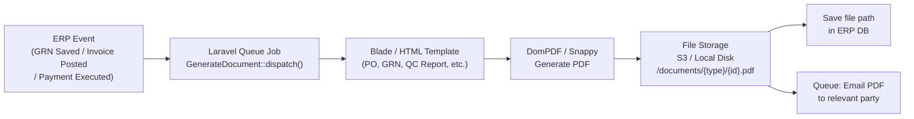

### Document Types & Triggers

| Document | Trigger Event | Recipients |
|----------|--------------|------------|
| Gate Entry Slip | GE created | Security Guard (print) |
| GRN PDF | GRN saved | Storekeeper, Finance |
| QC Inspection Report | Usage Decision saved | QC Manager, Procurement |
| Rejection Note | QC rejected | Vendor, Procurement |
| Putaway Task Sheet | QC accepted | Warehouse Operator |
| Vendor Invoice Summary | Invoice posted | Finance, Vendor |
| Payment Advice | Payment executed | Vendor (email) |

---

## 11. External Integrations

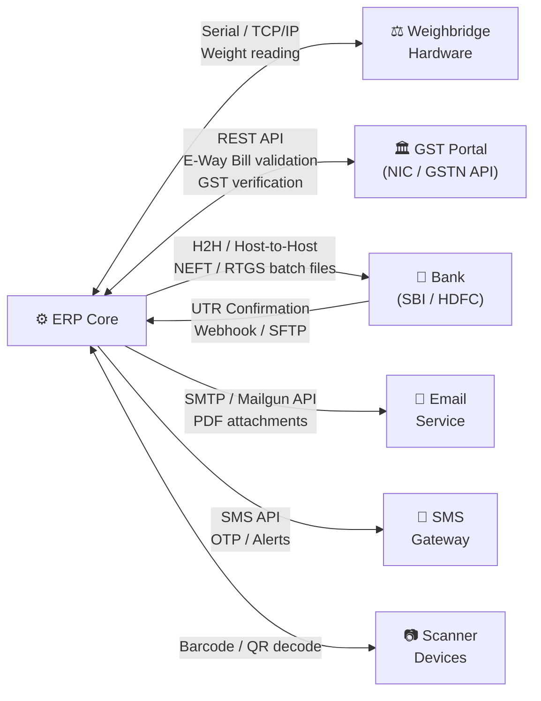

### Integration Details

| Integration | Protocol | Data Exchanged | Frequency |
|-------------|----------|---------------|-----------|
| **Weighbridge** | Serial / TCP-IP | Gross weight, Tare weight | Real-time on weigh event |
| **GST Portal (NIC)** | REST API (OAuth2) | E-Way Bill validation, GSTIN lookup | On-demand |
| **Bank H2H** | SFTP / API | Payment batch files, UTR confirmations | Scheduled daily |
| **Email (SMTP/Mailgun)** | SMTP / REST | GRN PDF, Payment Advice, Alerts | Event-driven |
| **SMS Gateway** | REST API | Gate arrival alerts, QC decisions | Event-driven |

---

## 12. System States & Transitions

### 12.1 Purchase Order States

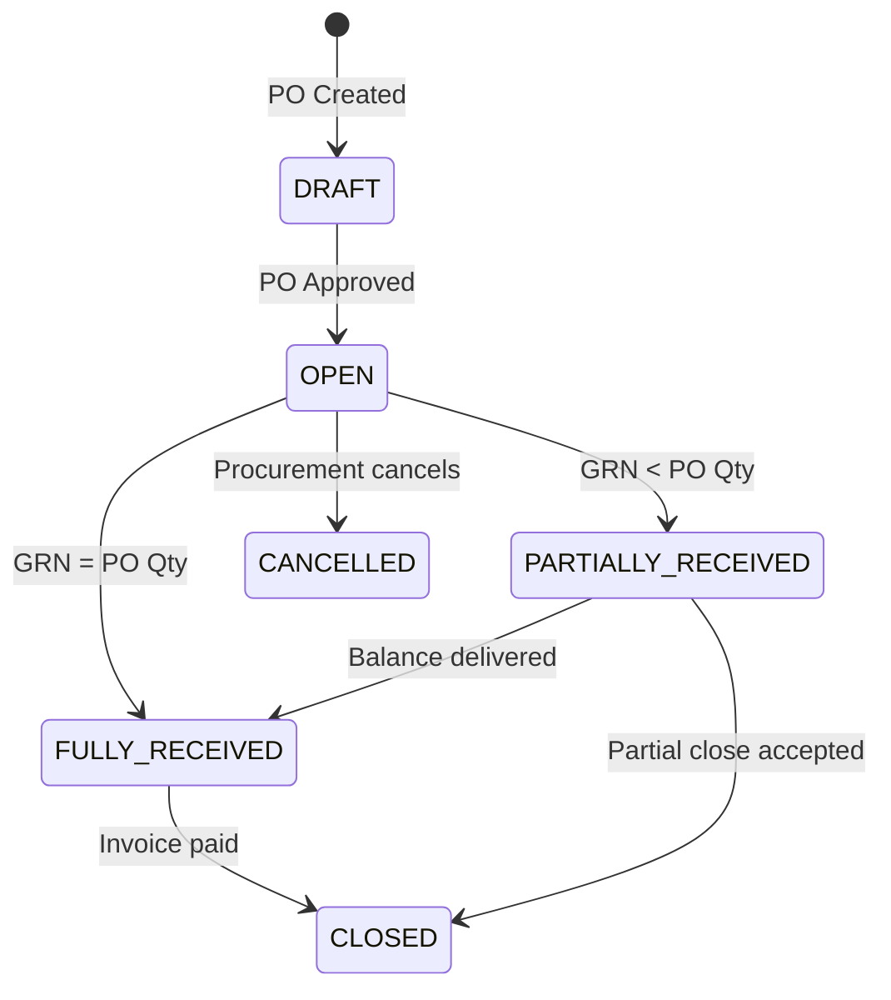

### 12.2 GRN / Stock States

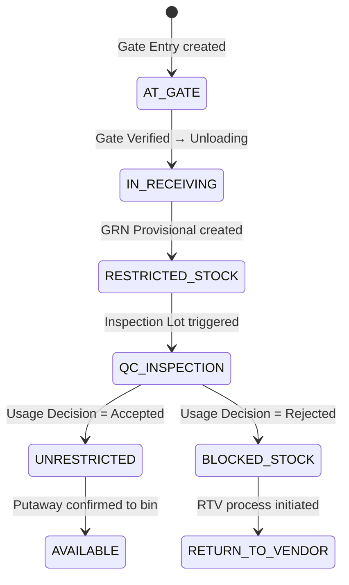

### 12.3 Invoice & Payment States

```mermaid
stateDiagram-v2
    [*] --> INVOICE_RECEIVED : AP Clerk registers invoice
    INVOICE_RECEIVED --> MATCHING : 3-Way match running
    MATCHING --> MATCHED : All 3 documents align
    MATCHING --> BLOCKED : Variance beyond tolerance
    BLOCKED --> MATCHING : Credit note received
    MATCHED --> POSTED : Invoice posted to ledger
    POSTED --> PAYMENT_PROPOSED : Added to payment run
    PAYMENT_PROPOSED --> PAYMENT_APPROVED : Finance Manager approves
    PAYMENT_APPROVED --> PAID : Bank transfer executed
    PAID --> CLEARED : UTR received; Vendor ledger zeroed
```

---

## Summary — Architecture At a Glance

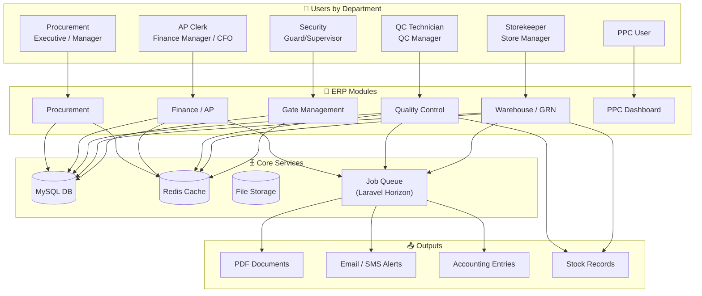

---

*End of Document — ERP Inward System Architecture v1.0*
